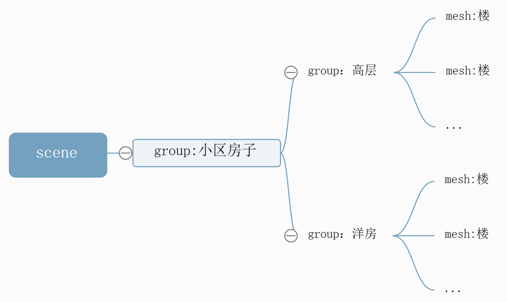

# 模型命名(.name属性)

## 概述

+ 在层级模型中可以给一些模型对象通过.name属性命名进行标记

  ```js
  const group = new THREE.Group();
  group.name='小区房子';
  const mesh = new THREE.Mesh(geometry, material);
  mesh.name='一号楼';
  ```

## 树结构层级模型设置.name属性

+ 通过代码创建了一个层级模型
+ 一般实际开发的时候，会加载外部的模型，然后从模型对象通过节点的名称 `.name` 查找某个子对象

  

  ```js
  // 批量创建多个长方体表示高层楼
  const group1 = new THREE.Group(); //所有高层楼的父对象
  group1.name = "高层";
  for (let i = 0; i < 5; i++) {
    const geometry = new THREE.BoxGeometry(20, 60, 10);
    const material = new THREE.MeshLambertMaterial({
        color: 0x00ffff
    });
    const mesh = new THREE.Mesh(geometry, material);
    mesh.position.x = i * 30; // 网格模型mesh沿着x轴方向阵列
    group1.add(mesh); //添加到组对象group1
    mesh.name = i + 1 + '号楼';
    // console.log('mesh.name',mesh.name);
  }
  group1.position.y = 30;

  const group2 = new THREE.Group();
  group2.name = "洋房";
  // 批量创建多个长方体表示洋房
  for (let i = 0; i < 5; i++) {
    const geometry = new THREE.BoxGeometry(20, 30, 10);
    const material = new THREE.MeshLambertMaterial({
        color: 0x00ffff
    });
    const mesh = new THREE.Mesh(geometry, material);
    mesh.position.x = i * 30;
    group2.add(mesh); //添加到组对象group2
    mesh.name = i + 6 + '号楼';
  }
  group2.position.z = 50;
  group2.position.y = 15;

  const model = new THREE.Group();
  model.name='小区房子';
  model.add(group1, group2);
  model.position.set(-50,0,-25);
  ```
