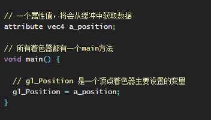
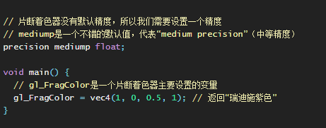

# 顶点着色器与片元着色器

## 顶点着色器

+ 顶点着色器： 用来描述顶点特征（如位置、颜色等）的程序

  + 变换操作：顶点坐标的变换、法线的变换、纹理坐标处理等
  + 将顶点坐标转换为2D屏幕空间中的坐标
  + 其他操作：计算光照方向、处理动画中的顶点等

+ 顶点：是指二维或三维空间的一个点，比如二维或三维图形的端点或交点

  

+ HTML中的顶点着色器代码

  ```html
  <script id="vs" type="x-shader/x-vertex">
    这里的内容相当于.vs文件中的内容
  </script>
  ```

+ 着色器代码可以写在单独的文件中，顶点着色器的文件名后缀为 `.vs`

## 片元着色器

+ 片元着色器： 进行逐片元处理过程（如光照）的程序

  + 接收顶点着色器传递过来的顶点值
  + 计算像素的最终颜色、纹理、光照等信息
  + 纹理采样、光照计算、环境光照等因素

+ 片元：是一个WebGL术语，你可以将其理解为像素

  

+ HTML中的顶点着色器代码

  ```html
  <script id="fs" type="x-shader/x-fragment">
    这里的内容相当于.fs文件中的内容
  </script>
  ```

+ 着色器代码可以写在单独的文件中，片元着色器的文件名后缀为 `.fs`

## 定义材质时的方法

+ 定义材质时的方法

  ```html
  <script id="vs" type="x-shader/x-vertex">
    这里的内容相当于.vs文件中的内容
  </script>

  <script id="fs" type="x-shader/x-fragment">
    这里的内容相当于.fs文件中的内容
  </script>

  <script >
    material = new THREE.ShaderMaterial({
      vertexShader: document.getElementById('vs').textContent,
      fragmentShader: document.getElementById('fs').textContent
    });
  </script>
  ```
