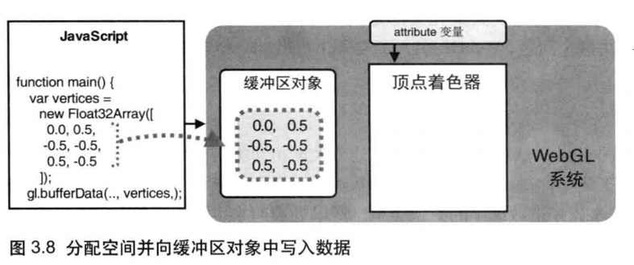

# 向缓冲区中写入数据

## 概述

+ `gl.bufferData(target, data, usage)` 开辟存储空间，向绑定在 `target` 上的缓冲区对象中写入数据 `data`

  + 参数

    + `target` : `gl.ARRAY_BUFFER` 或 `gl.ELEMENT_ARRAY_BUFFER`

    + `data` : 写入缓冲区对象的数据（类型化数组）

    + `usage` : 表示程序如何使用存储在缓冲区对象中的数据。该参数将帮助 WebGL 优化操作，但是就算你传入了错误的值，也不会终止程序（仅仅是降低程序的效率）

      + `gl.STATIC_DRAW` 只会向缓冲区对象中写入一次数据，但需要绘制很多次 *推荐*
      + `gl.STREAM_DRAW` 只会向缓冲区对象中写入一次数据，然后绘制若干次
      + `gl.DYNAMIC_DRAW` 会向缓冲区对象中多次写入数据，并绘制很多次

  + 返回值 无

+ 错误

  + `INVALLD_ENUM` target 不是上述值之一，这时将保持原有的绑定情况不变

  

  ```js
  // 顶点数据
  const vertices=new Float32Array([
    //x    y
    0.0,  0.1, //顶点
    -0.1,-0.1, //顶点
    0.1, -0.1  //顶点
  ])
  gl.bufferData(gl.ARRAY_BUFFER,vertices,gl.STATIC_DRAW);
  ```

+ 现在着色器虽然绑定了缓冲区，可以访问里面的数据了，但是我们还得让着色器知道这个仓库是给哪个变量的，比如咱们这里用于控制点位的attribute 变量。这样做是为了提高绘图效率
