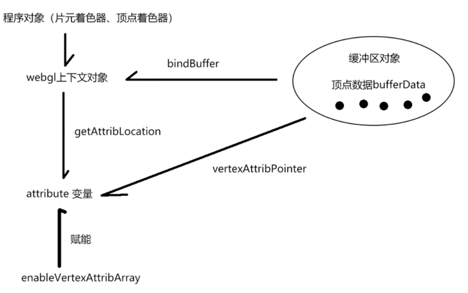

# 绘制多点

## 同时绘制多点

+ 需要用到缓冲区

  

## 绘制多点步骤

+ 步骤1 建立着色器源文件

  ```html
  <script id="vertexShader" type="x-shader/x-vertex">
    attribute vec4 a_Position;
    void main(){
        gl_Position = a_Position;
        gl_PointSize = 20.0;
    }
</script>
  <script id="fragmentShader" type="x-shader/x-fragment">
      void main(){
          gl_FragColor=vec4(1.0,1.0,0.0,1.0);
      }
  </script>
  ```

+ 步骤2 获取webgl 上下文

  ```js
  const canvas = document.getElementById('canvas');
  canvas.width=window.innerWidth;
  canvas.height=window.innerHeight;
  const gl = canvas.getContext('webgl');
  ```

+ 步骤3 初始化着色器

  ```js
  const vsSource = document.getElementById('vertexShader').innerText;
  const fsSource = document.getElementById('fragmentShader').innerText;
  initShaders(gl, vsSource, fsSource);
  ```

+ 步骤4 设置顶点点位

  ```js
  const vertices=new Float32Array([
      0.0,  0.1,
      -0.1,-0.1,
      0.1, -0.1
  ])
  const vertexBuffer=gl.createBuffer();
  gl.bindBuffer(gl.ARRAY_BUFFER,vertexBuffer);
  gl.bufferData(gl.ARRAY_BUFFER,vertices,gl.STATIC_DRAW);
  const a_Position=gl.getAttribLocation(gl.program,'a_Position');
  gl.vertexAttribPointer(a_Position,2,gl.FLOAT,false,0,0);
  gl.enableVertexAttribArray(a_Position);

  ```

+ 步骤5 清理画布

  ```js
  gl.clearColor(0.0, 0.0, 0.0, 1.0);
  gl.clear(gl.COLOR_BUFFER_BIT);
  ```

+ 步骤6 绘图

  ```js
  gl.drawArrays(gl.POINTS, 0, 3);
  ```

