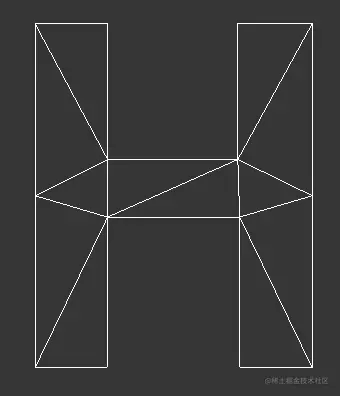

# 总结

## 概述

+ webgl 可以绘制三种面

  + `TRIANGLES` 单独三角形
  + `TRIANGLE_STRIP` 三角带
  + `TRIANGLE_FAN` 三角扇

+ 在实际的引擎开发中， `TRIANGLES` 是用得最多的
+ `TRIANGLES` 的优势是可以绘制任意模型，缺点是比较费点
+ 适合TRIANGLES 单独三角形的的模型

  

+ `TRIANGLE_STRIP` 和 `TRIANGLE_FAN` 的优点是相邻的三角形可以共用一条边，比较省点，然而其缺点也太明显，因为它们只适合绘制具备相应特点的模型

+ 适合 `TRIANGLE_STRIP` 三角带的模型

  

+ 适合 `TRIANGLE_FAN` 三角扇的模型

  

+ three.js 使用的绘制面的方式就是TRIANGLES，我们可以在其 `WebGLRenderer` 对象的源码的 `renderBufferImmediate` 方法中找到

  ```js
  _gl.drawArrays( _gl.TRIANGLES, 0, object.count );
  ```
