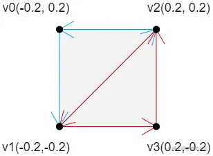
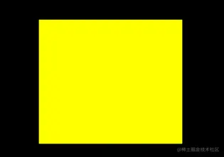

# 矩形

## 概述

+ webgl 可以绘制的面只有三角面，所以要绘制矩形面的话，只能用两个三角形去拼


## 三角带拼矩形的方法

+ 可以用 `gl.TRIANGLE_STRIP` 三角带拼矩形

## 代码实现

+ 步骤1 建立顶点数据

  ```js
  // 两个浮点代表一个顶点，依次是v0、v1、v2、v3
  const vertices = new Float32Array([
    -0.2, 0.2,
    -0.2,-0.2,
    0.2, 0.2,
    0.2,-0.2,
  ])
  ```

+ 步骤2 绘图

  ```js
  // 三角带、从第0个顶点开始画、画四个
  gl.drawArrays(gl.TRIANGLE_STRIP, 0, 4);
  ```

  
  

## 三角扇拼矩形

+ `TRIANGLE_FAN` 扇形

  ```js
  gl.drawArrays(gl.TRIANGLE_FAN, 0, 4);
  ```

  
  

