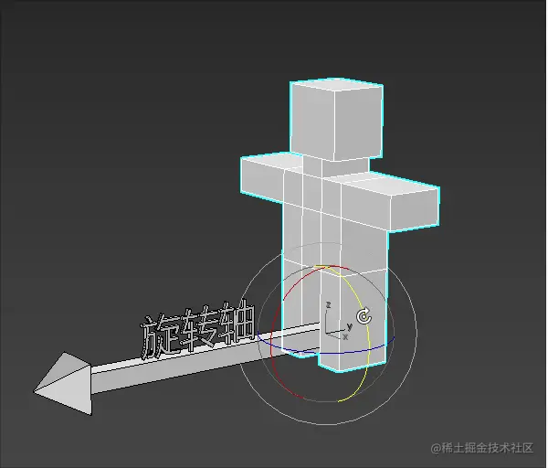

# 基础

## 概述

+ 三维物体的旋转要比位移复杂一点，因为三维物体的旋转需要知道以下条件

  + 旋转轴
  + 旋转方向
  + 旋转角度

  

## 旋转方向的正负

+ 物体的旋转方向是有正负之分的
+ 那何时为正，何时为负呢？
+ 在webgl 中，除裁剪空间之外的大部分功能都使用了 *右手坐标系*

  

+ 以上图为例

  + 当物体绕 z 轴，从x轴正半轴向y轴正半轴逆时针旋转时，是正向旋转，反之为负
  + 当物体绕 x 轴，从y轴正半轴向z轴正半轴逆时针旋转时，是正向旋转，反之为负
  + 当物体绕 y 轴，从z轴正半轴向x轴正半轴逆时针旋转时，是正向旋转，反之为负

+ 正向旋转

  
