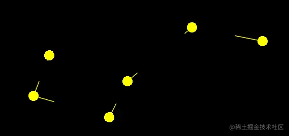

# 绘制线条

## 概述

+ 线条在mac电脑中是断的

  

## 原因 与 解决

+ 这种效果是由片元着色器导致的

+ 在用片元着色器绘图的时候，把线给过滤掉了
+ 因此，我需要告诉着色器当前绘图的方式，如果是 `POINTS` 方式绘图的话，就过滤一下圆圈以外的片元，否则就正常绘图

  ```js
  precision mediump float;
  void main(){
      float dist=distance(gl_PointCoord,vec2(0.5,0.5));
      if(dist<0.5){
          gl_FragColor=vec4(1,1,0,1);
      }else{
          discard;
      }
  }
  ```
