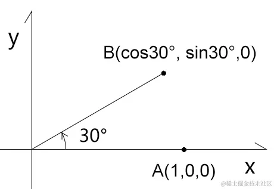
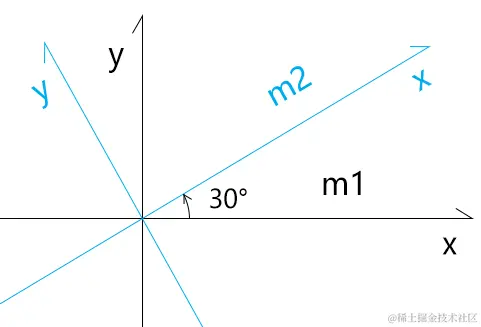

# 正交矩阵的旋转

## 概述

+ 为了更好的理解视图矩阵的运算，我们从基础说起

## 题1

+ 已知：点A(1,0,0)
+ 求：把点A绕z 轴逆时针旋转30°，旋转到B点的行主序矩阵m1
+ 解：

  ```js
  m1=[
      cos30°,-sin30°,0,0,
      sin30°,cos30°, 0,0,
      0,     0,      1,0,
      0,     0,      0,1,
  ]
  B=m1*A
  B.x=(cos30°,-sin30°,0,0)·(1,0,0,1)=cos30°
  B.y=(sin30°,cos30°, 0,0)·(1,0,0,1)=sin30°
  ```

  

## 题2

+ 继题1的已知条件
+ 求：把点B绕z 轴逆时针旋转-30°，旋转到A点的列行序矩阵m2

  ```js
  m2=[
      cos-30°,-sin-30°,0,0,
      sin-30°,cos-30°, 0,0,
      0,      0,       1,0,
      0,      0,       0,1,
  ]
  m2=[
      cos30°, sin30°,  0,0,
      -sin30°,cos30°,  0,0,
      0,      0,       1,0,
      0,      0,       0,1,
  ]
  ```

+ 观察题1、题2，我们可以发现两个规律：

  + m2 是m1 的逆矩阵
  + m2 也是m1 的转置矩阵

+ 由此我们可以得到一个结论：正交旋转矩阵的逆矩阵就是其转置矩阵。

## 题3

+ 已知：

  

+ 三维直角坐标系m1，其基向量是：

  + `x(1,0,0)`
  + `y(0,1,0)`
  + `z(0,0,1)`

+ 三维直角坐标系m2，其基向量是：

  + `x(cos30°, sin30°,0)`
  + `y(-sin30°,cos30°,0)`
  + `z(0, 0, 1)`


+ 求：将m1中的基向量对齐到m2的行主序矩阵m3

+ 解：

  + 将m2的基向量x,y,z 中的x 分量写入m3第1行;
  + 将m2的基向量x,y,z 中的y 分量写入m3第2行;
  + 将m2的基向量x,y,z 中的z 分量写入m3第3行。

  ```js
  m3=[
      cos30°,-sin30°,0,0,
      sin30°,cos30°, 0,0,
      0,     0,      1,0,
      0,     0,      0,1,
  ]
  ```

## 题4

+ 继题3的已知条件

  

+ 求：将m2中的基向量对齐到m1的行主序矩阵m4

+ 解：

  + 由题3已知：将m1中的基向量对齐到m2的行主序矩阵是m3
  + 由题4的问题可知：m4就是m3的逆矩阵
  + 因为：正交旋转矩阵的逆矩阵就是其转置矩阵

+ 所以：m4就是m3的转置矩阵

  ```js
  m3=[
      cos30°,-sin30°,0,0,
      sin30°,cos30°, 0,0,
      0,     0,      1,0,
      0,     0,      0,1,
  ]
  m4=[
      cos30°,sin30°,0,0,
      -sin30°,cos30°,0,0,
      0,0,1,0,
      0,0,0,1
  ]
  ```
