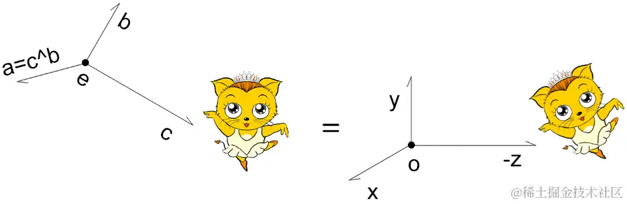
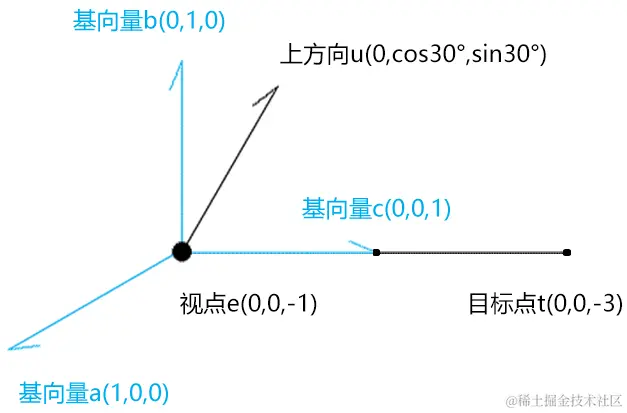

# 计算视图矩阵

## 计算视图矩阵步骤

+ 计算视图矩阵

  

+ 步骤1 先位移：写出把视点e(ex,ey,ez) 对齐到 O点上的行主序位移矩阵mt
+ 步骤2写出把{o;x,y,-z} 对齐到{e;a,b,c} 的行主序旋转矩阵mr1

  +​ 把a,b,-c的x 分量写入mr1的第1行；
  +​ 把a,b,-c的y 分量写入mr1的第2行；
  +​ 把a,b,-c的z 分量写入mr1的第3行；

  ```js
  mr1=[
      ax, bx, -cx, 0,
      ay, by, -cy, 0,
      az, bz, -cz, 0,
      0,  0,   0,  1
  ]
  ```

+ 步骤3 计算mr1的逆矩阵mr2

  + 因为正交旋转矩阵的逆矩阵就是其转置矩阵，所以mr2就是mr1的转置矩阵。

  ```js
  mr2=[
      ax, ay, az, 0,
      bx, by, bz, 0,
      -cx,-cy,-cz, 0,
      0,  0,   0, 1
  ]
  ```

+ 步骤4 视图矩阵=mr2*mt

## 视图矩阵的代码实现

+ 基于视点、目标点、上方向生成视图矩阵

  

  ```js
  function getViewMatrix(e, t, u) {
    //基向量c，视线
    const c = new Vector3().subVectors(e, t).normalize()
    //基向量a，视线和上方向的垂线
    const a = new Vector3().crossVectors(u, c).normalize()
    //基向量b，修正上方向
    const b = new Vector3().crossVectors(c, a).normalize()
    //正交旋转矩阵
    const mr = new Matrix4().set(
      ...a, 0,
      ...b, 0,
      -c.x, -c.y, -c.z, 0,
      0, 0, 0, 1
    )
    //位移矩阵
    const mt = new Matrix4().set(
      1, 0, 0, -e.x,
      0, 1, 0, -e.y,
      0, 0, 1, -e.z,
      0, 0, 0, 1
    )
    return mr.multiply(mt).elements
  }
  ```

+ lookAt 方法就是从一个新的角度去看某一个东西的意思

  + e 视点
  + t 目标点
  + u 上方向

+ 在其中我借助了Three.js 的Vector3 对象

  + subVectors(e, t) 向量e减向量t
  + normalize() 向量的归一化
  + crossVectors(u, d) 向量u 和向量d的叉乘

  ```js
  crossVectors( a, b ) {
    const ax = a.x, ay = a.y, az = a.z;
    const bx = b.x, by = b.y, bz = b.z;
    this.x = ay * bz - az * by;
    this.y = az * bx - ax * bz;
    this.z = ax * by - ay * bx;
    return this;
  }
  ```

+ 解释一下上面基向量a,b,c 的运算原理，以下图为例

  

+ 视线c 之所以是视点e减目标点t，是为了取一个正向的基向量。

  ```js
  c=(e-t)/|e-t|
  c=(0,0,2)/2
  c=(0,0,1)
  ```

+ 基向量a是上方向u和向量c的叉乘

  ```js
  a=u^c/|u^c|
  a=(cos30°,0,0)/cos30°
  a=(1,0,0)
  ```

+ 基向量b是向量c和向量a的叉乘，可以理解为把上方向摆正

  ```js
  b=c^a/|c^a|
  b=(0,1,0)/1
  b=(0,1,0)
  ```
