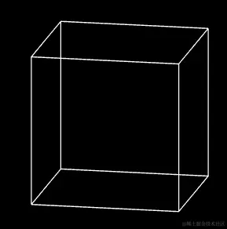

# 测试

## 步骤

+ 步骤1 顶点着色器

  ```js
  <script id="vertexShader" type="x-shader/x-vertex">
      attribute vec4 a_Position;
      //视图矩阵
      uniform mat4 u_ViewMatrix;
      void main(){
        gl_Position = u_ViewMatrix*a_Position;
      }
  </script>

  ```

+ 步骤2 建立视图矩阵，并传递给顶点着色器

  ```js
  const u_ViewMatrix = gl.getUniformLocation(gl.program, 'u_ViewMatrix')
  const viewMatrix = getViewMatrix(
    new Vector3(0.3, 0.2, 0.5),
    new Vector3(0.0, 0.1, 0),
    new Vector3(0, 1, 0)
  )
  gl.uniformMatrix4fv(u_ViewMatrix, false, viewMatrix)

  ```

+ 步骤3 绘图方法

  ```js
  gl.clearColor(0.0, 0.0, 0.0, 1.0);
  gl.clear(gl.COLOR_BUFFER_BIT);
  gl.drawArrays(gl.LINES, 0, indices.length);
  ```

  

## 注

+ three.js 里的lookAt() 方法便可以实现矩阵的正交旋转，其参数也是视点、目标点、上方向，它的实现原理和我们视图矩阵里说的正交旋转都是一样的

  ```js
  const u_ViewMatrix = gl.getUniformLocation(gl.program, 'u_ViewMatrix')
  const viewMatrix = new Matrix4().lookAt(
      new Vector3(0.5, 0.5, 1),
      new Vector3(0, 0, 0),
      new Vector3(0, 1, 0),
  )
  gl.uniformMatrix4fv(u_ViewMatrix, false, viewMatrix.elements)
  ```

+ 不过three.js 里的相机的视图矩阵并没有翻转相机视线，其视线的翻转是放到投影矩阵里做的，在后面的课程里我会细说投影矩阵

+ 按理说，在我们当前的视图矩阵里，也不需要翻转相机视线的，我之所以如此做，是为了让大家更整体的理解这个过程
