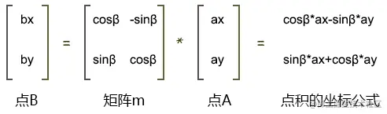

# 矩阵和向量的乘法

## 概述

+ 矩阵和向量的乘法图

  

+ 阵乘以向量时，向量是几维的，那矩阵中就应该有几个向量
+ 如上图向量v 是2维的，那么矩阵中就有2组向量，这两组向量可以是横着的两组向量，也可以是竖着的两组向量

  + 横着的两组向量是：向量(a,b)、向量(e,f)
  + 竖着的两组向量是：向量(a,e)、向量(b,f)

+ 用专业术语来说：

  + 横着的两组遵循的规则是行主序，即将矩阵中的一行数据视之为一个向量
  + 竖着的两组遵循的规则是列主序，即将矩阵中的一列数据视之为一个向量

+ 至于我们是使用行主序，还是列主序，这就得看规则的定制者了

+ 在webgl 里，矩阵元素的排列规则是列主序

+ 数学中常用的写法是行主序，所以我们接下来就用行主序举例子了

+ 矩阵和向量相乘的规则就是让矩阵中的每个向量和向量v相乘

+ 向量和向量相乘，就是在求向量的点积，其结果是一个实数，而不再是向量

+ 比如上图中，向量(a,b)乘以向量v(x,y)的结果是

  ```js
  a*x + b*y
  ```

+ 因为a、b、x、y都是实数，所以其结果也是实数。

+ 上图中，矩阵m乘以向量v 会得到两个结果，即ax+by和ex+fy。

+ 这两个结果会构成一个新的向量v'(x',y')

  ```js
  x' = a*x + b*y
  y' = e*x + f*y
  ```

+ 这时我们可以将其和数学里的旋转公式做一下比较。

+ 点A(ax,ay)围绕z轴旋β度,其旋转后的位置是点B(bx,by)，则：

  ```js
  bx=cosβ*ax-sinβ*ay
  by=sinβ*ax+cosβ*ay
  ```

+ 对比上面的两组公式，试想一下：
+ 向量v是不是可以当成一个点位呢？
+ 答案是可以的。
+ 那我现在就让向量v代表的位置，就是点A的位置。
+ 那么矩阵m乘以向量v，是不是可以让向量v代表的这个点位旋转β度呢？
+ 如果可以，那么矩阵里的元素应该满足什么条件呢？
+ 满足以下条件即可：

  ```js
  a=cosβ
  b=-sinβ
  e=sinβ
  f=cosβ
  ```

+ 这样，用矩阵乘以向量的方法得到的旋转结果和用数学公式得到的结果就是一样的，即

  ```js
  a*x+b*y=cosβ*ax-sinβ*ay
  e*x+f*y=sinβ*ax+cosβ*ay
  ```

+ 最终我们就可以用矩阵乘以向量的方式让点p旋转β度

  
  


