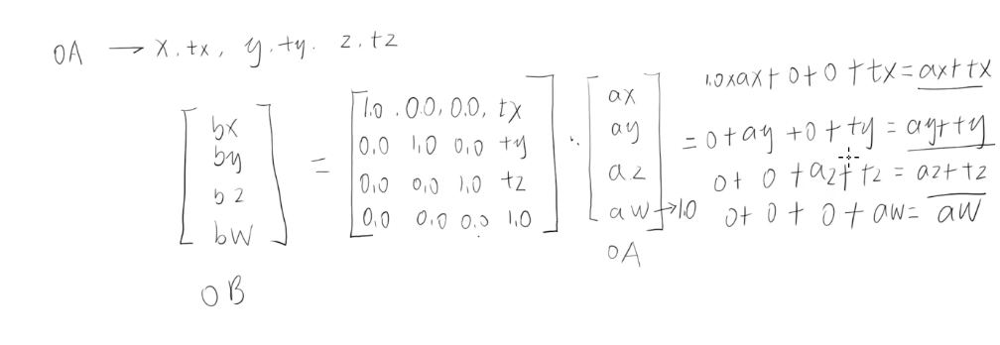

# 矩阵平移

## 概述

+ 比如我要让顶点的x移动0.1，y移动0.2，z移动0.3

  

## 着色器

+ 顶点着色可以这样写

  ```html
  <script id="vertexShader" type="x-shader/x-vertex">
      attribute vec4 a_Position;
      // 列主序
      mat4 m4=mat4(
        1.0, 0.0, 0.0,0.0,
        0.0, 1.0, 0.0,0.0,
        0.0, 0.0, 1.0,0.0,
        0.1, 0.2, 0.3,1.0
      );
      void main(){
        gl_Position = m4*a_Position;
      }
  </script>
  ```

  ```html
  <!-- 或者 -->
  <script id="vertexShader" type="x-shader/x-vertex">
      attribute vec4 a_Position;
      float tx=0.1
      float ty=0.2
      float tz=0.3
      // 列主序
      mat4 m4=mat4(
        1.0, 0.0, 0.0, 0.0,
        0.0, 1.0, 0.0, 0.0,
        0.0, 0.0, 1.0, 0.0,
        tx,  ty,  tz,  1.0
      );
      void main(){
        gl_Position = m4*a_Position;
      }
  </script>
  ```
