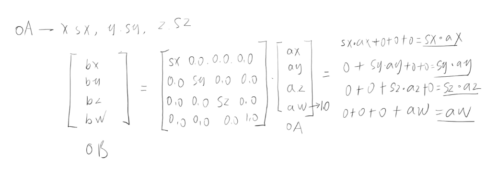

# 矩阵缩放

## 概述

+ 比如我要让顶点在x轴向缩放2，y轴向缩放3，轴向缩放4

  

+ 顶点着色可以这样写：

  ```js
  <script id="vertexShader" type="x-shader/x-vertex">
      attribute vec4 a_Position;
      // 列主序
      mat4 m4=mat4(
        2.0, 0.0, 0.0,0.0,
        0.0, 3.0, 0.0,0.0,
        0.0, 0.0, 4.0,0.0,
        0.0, 0.0, 0.0,1.0
      );
      void main(){
        gl_Position = m4*a_Position;
      }
  </script>
  ```

  ```html
  <!-- 或者 -->
  <script id="vertexShader" type="x-shader/x-vertex">
      attribute vec4 a_Position;
      float sx=2.0
      float sy=3.0
      float sz=4.0
      // 列主序
      mat4 m4=mat4(
        sx,  0.0, 0.0, 0.0,
        0.0, sy,  0.0, 0.0,
        0.0, 0.0, sz,  0.0,
        0.0, 0.0, 0.0, 1.0
      );
      void main(){
        gl_Position = m4*a_Position;
      }
  </script>
  ```
