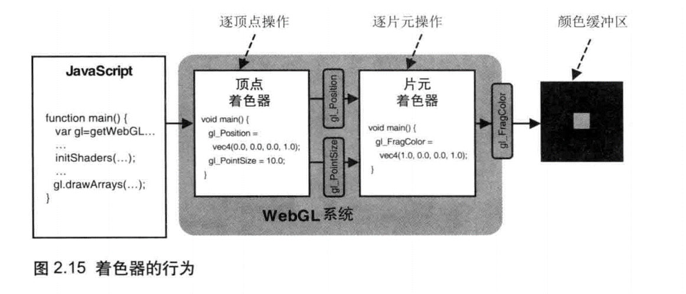

# webgl 绘制过程

## 过程

1. 获取 WebGL 绘图上下文
2. 初始化着色器
3. 设置点的坐标信息
4. 设置 `<canvas>` 背景色
5. 清空 `<canvas>`
6. 绘制

  
  

## 步骤1：获取 WebGL 绘图上下文

1. 在html中建立canvas 画布

    ```html
    <canvas id="canvas"></canvas>
    ```

2. 在js中获取canvas画布

    ```js
    const canvas=document.getElementById('canvas’);
    ```

3. 使用canvas 获取webgl 绘图上下文

    ```js
    const gl=canvas.getContext('webgl’);
    ```

## 步骤2：初始化着色器

+ code

  ```html
  <!-- 顶点着色器 -->
  <script type="notjs" id="vertex">
    void main () {
      gl_Position = vec4(0, 0, 0, 1);
      gl_PointSize = 10.0;
    }
  </script>

  <!-- 片元着色器 -->
  <script type="notjs" id="fragment">
    void main () {
      gl_FragColor = vec4(0, 0, 0, 1);
    }
  </script>

  <script>
    const canvas = document.getElementById('canvas'); // /canvas 画布
    canvas.width = window.innerWidth;
    canvas.height = window.innerHeight;
    const gl = canvas.getContext('webgl'); // webgl画笔


    // 获取顶点着色器内容
    const vertexStr = document.getElementById('vertex').innerText;
    // 获取片元着色器内容
    const fragmentStr = document.getElementById('fragment').innerText;

    // 创建着色器
    const createShader = (gl, sourceCode, type) => {
      const shader = gl.createShader(type); //根据着色类型，建立着色器对象
      gl.shaderSource(shader, sourceCode);   //将着色器源文件传入着色器对象中
      gl.compileShader(shader);  //编译着色器对象

      // 查看是否编译成功
      if (!gl.getShaderParameter(shader, gl.COMPILE_STATUS)) {
        // 获取编译错误
        var info = gl.getShaderInfoLog(shader);
        throw "Could not compile WebGL program. \n\n" + info;
      }
      return shader;
    }

    // 创建顶点着色器
    const vertexShader = createShader(gl, vertexStr, gl.VERTEX_SHADER);
    // 创建片元着色器
    const fragmentShader = createShader(gl, fragmentStr, gl.FRAGMENT_SHADER);

    // 创建程序
    const createProgram = (gl, vertexShader, fragmentShader) => {
      const program = gl.createProgram();

      // 添加预先定义好的顶点着色器和片段着色器
      gl.attachShader(program, vertexShader); //把顶点着色对象装进程序对象中
      gl.attachShader(program, fragmentShader);  //把片元着色对象装进程序对象中

      gl.linkProgram(program); //连接webgl上下文对象和程序对象

      // 查看是否编译成功
      if (!gl.getProgramParameter(program, gl.LINK_STATUS)) {
        // 获取编译错误
        var info = gl.getShaderInfoLog(shader);
        throw "Could not compile WebGL program. \n\n" + info;
      }

      return program;
    }

    const program = createProgram(gl, vertexShader, fragmentShader);
    gl.useProgram(program); // 启动程序对象
  </script>
  ```
