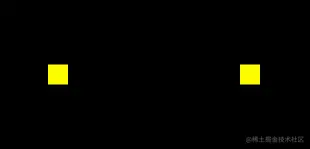

# webgl 的同步绘图原理

## 概述

+ 具备canvas 2d可能会认为无法画出多点是 `gl.clear(gl.COLOR_BUFFER_BIT)` 清理画布导致，因为我们在用canvas 2d 做动画时，其中就有一个 `ctx.clearRect()` 清理画布的方法

## 如果清除 gl.clear()

+ 如果清除 `gl.clear()`

  ```js
  gl.vertexAttrib2f(a_Position,x,y);
  //gl.clear(gl.COLOR_BUFFER_BIT);
  gl.drawArrays(gl.POINTS, 0, 1);
  ```

  

+ 当我们鼠标点击画布时，画布中原本的黑色已经没有了，而且我们每次也只能画一个点

## gl.drawArrays 绘图分析

+ `gl.drawArrays(gl.POINTS, 0, 1)` 方法和canvas 2d 里的 `ctx.draw()` 方法是不一样的，` ctx.draw()` 真的像画画一样，一层一层的覆盖图像

+ `gl.drawArrays()` 方法只会同步绘图，走完了js 主线程后，再次绘图时，就会从头再来。也就说，异步执行的 `drawArrays()` 方法会把画布上的图像都刷掉

+ 例如

  + 先画两个点

    ```js
    const a_Position=gl.getAttribLocation(gl.program,'a_Position');
    gl.clearColor(0.0, 0.0, 0.0, 1.0);
    gl.clear(gl.COLOR_BUFFER_BIT);

    gl.vertexAttrib2f(a_Position,0.1,0);
    gl.drawArrays(gl.POINTS, 0, 1);

    gl.vertexAttrib2f(a_Position,-0.1,0);
    gl.drawArrays(gl.POINTS, 0, 1);
    ```

    


  + 一秒后，再画一个点

    ```js
    const a_Position=gl.getAttribLocation(gl.program,'a_Position');
    gl.clearColor(0.0, 0.0, 0.0, 1.0);
    gl.clear(gl.COLOR_BUFFER_BIT);
    gl.vertexAttrib2f(a_Position,0.1,0);
    gl.drawArrays(gl.POINTS, 0, 1);
    gl.vertexAttrib2f(a_Position,-0.1,0);
    gl.drawArrays(gl.POINTS, 0, 1);
    setTimeout(()=>{
      gl.vertexAttrib2f(a_Position,0,0);
      gl.drawArrays(gl.POINTS, 0, 1);
    },1000)
    ```

    

  + 以前画好的两个点没了，黑色背景也没了

## 解决之法

+ 可以用数组把一开始的那两个顶点存起来，在异步绘制第3个顶点的时候，把那两个顶点也一起画上

  ```js
  const a_Position=gl.getAttribLocation(gl.program,'a_Position');
  gl.clearColor(0.0, 0.0, 0.0, 1.0);
  gl.clear(gl.COLOR_BUFFER_BIT);
  const g_points=[  {x:0.1,y:0},  {x:-0.1,y:0},];
  render();
  setTimeout(()=>{
    g_points.push({x:0,y:0});
    render();
  },1000)
  function render(){
    gl.clear(gl.COLOR_BUFFER_BIT);
    g_points.forEach(({x,y})=>{
      gl.vertexAttrib2f(a_Position,x,y);
      gl.drawArrays(gl.POINTS, 0, 1);
    })
  }
  ```

  

+ 绘制多个点示例

  ```js
  const a_Position=gl.getAttribLocation(gl.program,'a_Position');
  gl.clearColor(0.0, 0.0, 0.0, 1.0);
  gl.clear(gl.COLOR_BUFFER_BIT);

  const g_points=[];
  canvas.addEventListener('click',function(event){
    const {clientX,clientY}=event;
    const {left,top,width,height}=canvas.getBoundingClientRect();
    const [cssX,cssY]=[
      clientX-left,
      clientY-top
    ];
    const [halfWidth,halfHeight]=[width/2,height/2];
    const [xBaseCenter,yBaseCenter]=[cssX-halfWidth,cssY-halfHeight];
    const yBaseCenterTop=-yBaseCenter;
    const [x,y]=[xBaseCenter/halfWidth,yBaseCenterTop/halfHeight];
    g_points.push({x,y});
    gl.clear(gl.COLOR_BUFFER_BIT);
    g_points.forEach(({x,y})=>{
      gl.vertexAttrib2f(a_Position,x,y);
      gl.drawArrays(gl.POINTS, 0, 1);
    })
  })
  ```

  

## webgl 同步绘图原理总结

+ webgl 的同步绘图的现象，其实是由webgl 底层内置的颜色缓冲区导致的

+ “胸有成竹”大家知道吧？这个颜色缓冲区就是“胸有成竹”的胸，它在电脑里会占用一块内存
+ 在我们使用webgl 绘图的时候，是先在颜色缓冲区中画出来，这样的图像还在胸中，所以外人看不见，只有webgl系统自己知道

+ 在我们想要将图像显示出来的时候，那就照着颜色缓冲区中的图像去画，这个步骤是webgl 内部自动完成的，我们只要执行绘图命令即可

+ 颜色缓冲区中存储的图像，只在当前线程有效。比如我们先在js 主线程中绘图，主线程结束后，会再去执行信息队列里的异步线程
+ 在执行异步线程时，颜色缓冲区就会被webgl 系统重置，我们曾经在主线程里的“胸有成竹”也就没了，既然没了，也就画不出那时的图像了

