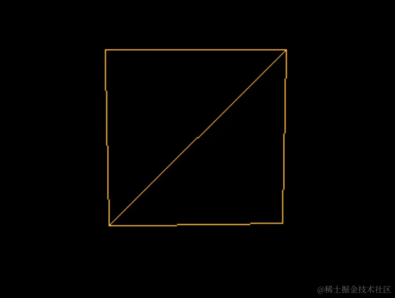
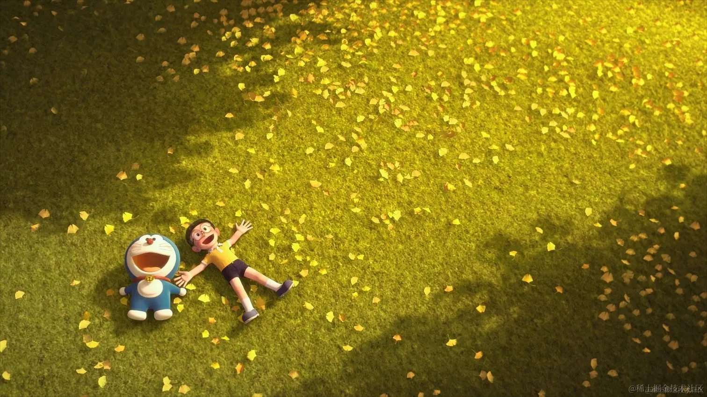
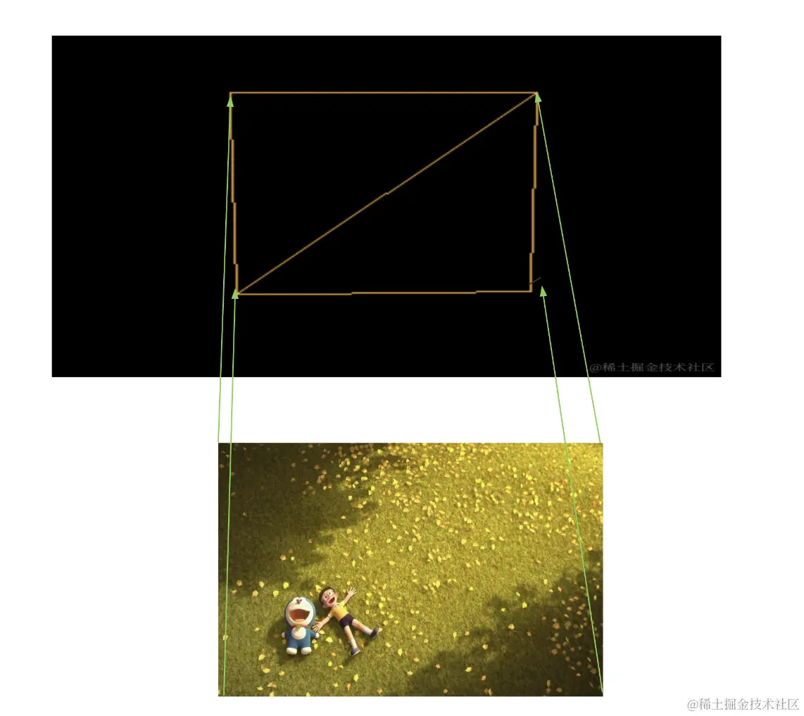
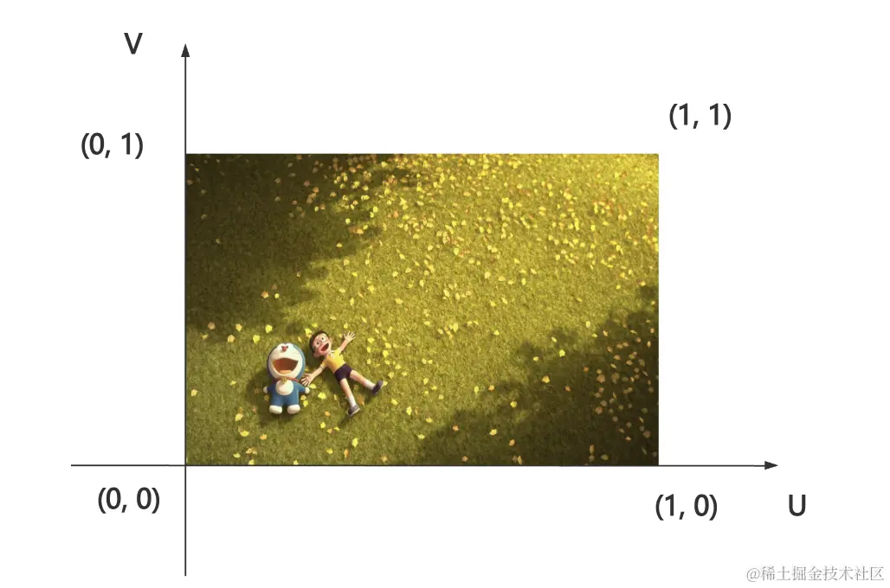
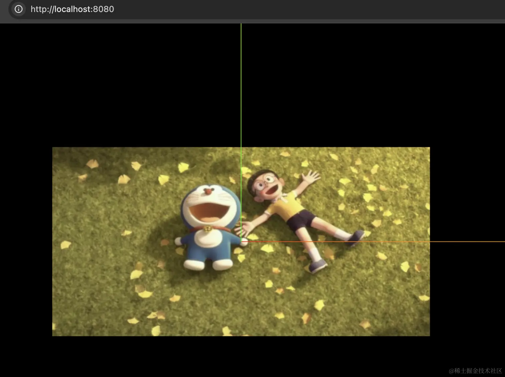

# UV坐标

## 概述

+ 画一个平面几何体 PlaneGeometry 需要 6 个顶点索引，2 个三角形

  

+ 那如果现在有一张图

  

+ 把它作为材质的纹理贴图加到这个平面。上那怎么加呢？是不是应该这样：

  

+ 每个顶点对应图片的一个角。我们给它个坐标系

  

+ 这样每个顶点渲染图片哪个位置的颜色，就直接看这个 0,0 到 1,1 的坐标就可以了

  + 这就是 uv 坐标

+ 为啥 material.map 叫颜色贴图呢？

  + 其实就是根据 uv 坐标来取纹理图片中的对应位置的颜色

  + 各种几何体都有默认的 uv 坐标，也就是如何来贴图

## 自定义 uv坐标

+ `geometry.attributes.uv` 是和顶点一一对应的 uv 坐标

  ```js
  const geometry = new THREE.PlaneGeometry(200, 100);

  const loader = new THREE.TextureLoader();
  const texture = loader.load('./bg.png');
  texture.colorSpace = THREE.SRGBColorSpace;

  const material = new THREE.MeshBasicMaterial(({
    map: texture
  }));

  const mesh = new THREE.Mesh(geometry, material);
  ```

  ```js
  // 修改uv坐标
  const uvs = new Float32Array([
    0, 0.5,
    0.5, 0.5,
    0, 0,
    0.5, 0
  ]);

  geometry.attributes.uv = new THREE.BufferAttribute(uvs, 2);
  ```

  
