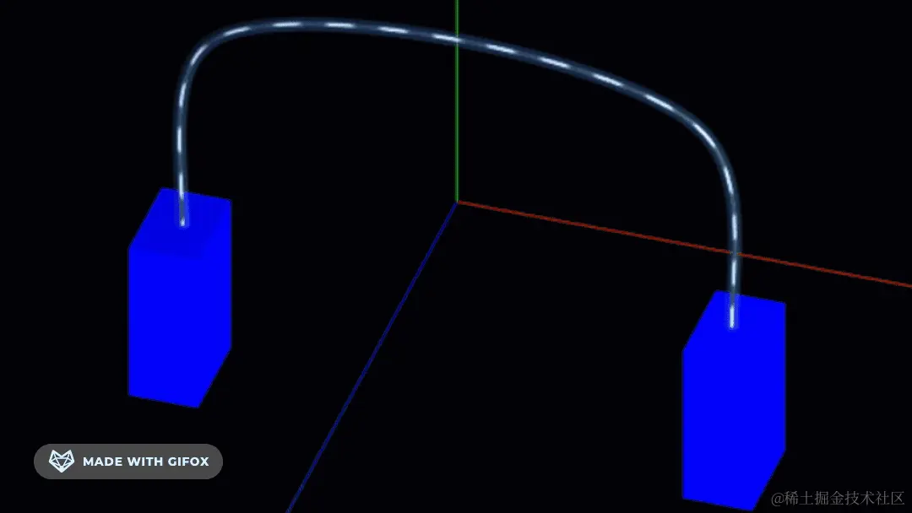

# UV 动画

## 概述

+ 纹理对象 `Texture` 有个 `offset` 属性，可以让纹理贴图在 x、y 方向做一些偏移。

+ 这相当于改变了 uv 坐标，所以这种改变 `texture.offset` 的动画叫做 uv 动画

  

+ 不断改变纹理贴图的 offset，让它动起来

  ```js
  texture.offset.x += 0.5;//纹理U方向偏移
  ```

  ```js
  texture.offset.y += 0.5;//纹理V方向偏移
  ```

## 纹理对象.wrapS或.wrapT与.offset组合使用

+ 当你通过 `.offset` 设置了纹理映射偏移后，是否把 `.wrapS` 或 `.wrapT` 设置为重复映射模式 `THREE.RepeatWrapping` ，两种情况的渲染效果差异

  ```js
  texture.offset.x +=0.5;//纹理U方向偏移

  // 设置.wrapS也就是U方向，纹理映射模式(包裹模式)
  texture.wrapS = THREE.RepeatWrapping;//对应offste.x偏移
  ```

  ```js
  texture.offset.y +=0.5;//纹理V方向偏移

  // 设置.wrapT也就是V方向，纹理映射模式
  texture.wrapT = THREE.RepeatWrapping;//对应offste.y偏移
  ```

## 纹理UV动画

+ 纹理对象Texture的 `.offset` 的功能是偏移贴图在 `Mesh` 上位置

  ```js
  // 渲染循环
  function render() {
    texture.offset.x +=0.001;//设置纹理动画：偏移量根据纹理和动画需要，设置合适的值
    renderer.render(scene, camera);
    requestAnimationFrame(render);
  }
  render();
  ```

## 纹理贴图阵列 + UV动画

+ 通过阵列纹理贴图设置 `.map` ,这样的话贴图像素可以更小一些

  ```js
  // 设置U方向阵列模式
  texture.wrapS = THREE.RepeatWrapping;
  // uv两个方向纹理重复数量
  texture.repeat.x = 50;//注意选择合适的阵列数量
  ```

  ```js
  // 渲染循环
  function render() {
    texture.offset.x +=0.1;//设置纹理动画：偏移量根据纹理和动画需要，设置合适的值
    renderer.render(scene, camera);
    requestAnimationFrame(render);
  }
  render();
  ```

