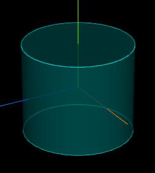

# 模型边界线EdgesGeometry

## 概述

+ 借助 `EdgesGeometry` 可以给模型设置一个模型边界线

  

## 长方体边线

+ 先用 `EdgesGeometry` 重新计算长方体几何体，返回一个新的几何体，然后用线模型 `LineSegments` 模型渲染新的几何体即可

  ```js
  const geometry = new THREE.BoxGeometry(50, 50, 50);
  const material = new THREE.MeshLambertMaterial({
    color: 0x004444,
    transparent:true,
    opacity:0.5,
  });
  const mesh = new THREE.Mesh(geometry, material);

  // 长方体作为EdgesGeometry参数创建一个新的几何体
  const edges = new THREE.EdgesGeometry(geometry);
  const edgesMaterial = new THREE.LineBasicMaterial({
    color: 0x00ffff,
  })
  const line = new THREE.LineSegments(edges, edgesMaterial);
  mesh.add(line);
  ```

## 圆柱边线

+ 圆柱边线

  ```js
  const geometry = new THREE.CylinderGeometry(60, 60, 100, 30);
  const edges = new THREE.EdgesGeometry(geometry);
  ```

  

  ```js
  import { CylinderGeometry,MeshLambertMaterial,LineBasicMaterial,EdgesGeometry,LineSegments, Mesh} from 'three';

  const geometry = new CylinderGeometry(60, 60, 100, 30);
  const material = new MeshLambertMaterial({
    color: 0x004444,
    transparent:true,
    opacity:0.5,
  });
  const mesh = new Mesh(geometry, material);

  // 长方体作为EdgesGeometry参数创建一个新的几何体
  const edges = new EdgesGeometry(geometry);
  const edgesMaterial = new LineBasicMaterial({
    color: 0x00ffff,
  })
  const line = new LineSegments(edges, edgesMaterial);
  mesh.add(line);

  export default mesh;
  ```

+ 相邻面法线夹角大于30度，才会显示线条

  ```js
  const edges = new THREE.EdgesGeometry(geometry,30);
  ```

  

## 外部gltf模型设置材质和边线

+ 外部gltf模型设置材质和边线

  

  ```js
  import { CylinderGeometry,MeshLambertMaterial,LineBasicMaterial,EdgesGeometry,LineSegments, Mesh,Group} from 'three';

  import { GLTFLoader } from 'three/addons/loaders/GLTFLoader.js';

  const loader = new GLTFLoader();
  const model = new Group();
  loader.load("./建筑模型.gltf", gltf => {
    const scene = gltf.scene;
    scene.traverse(obj => {
      if(obj.isMesh) {
        // 长方体作为EdgesGeometry参数创建一个新的几何体
        const edges = new EdgesGeometry(obj.geometry);
        const edgesMaterial = new LineBasicMaterial({
          color: 0x00ffff,
        })
        const line = new LineSegments(edges, edgesMaterial);
        obj.add(line);
        obj.material = new MeshLambertMaterial({
          color: 0x004444,
          transparent:true,
          opacity:0.5,
        })
      }
    })

    model.add(scene)
  })

  export default model;
  ```
