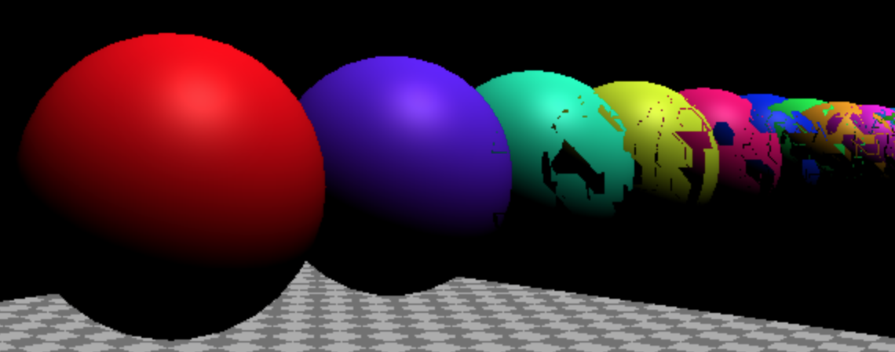
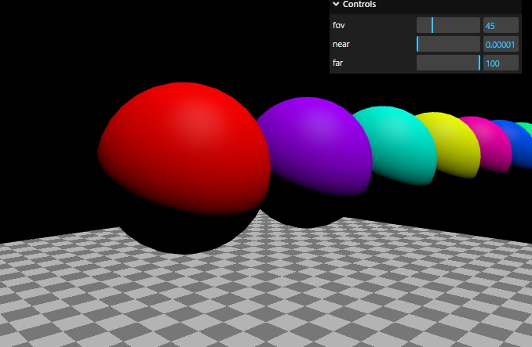

# 解决谍影锯齿闪烁重影

## logarithmicDepthBuffer

+ logarithmicDepthBuffer  官方解释: 是否使用对数深度缓存
+ 如果要在单个场景中处理巨大的比例差异，就有必要使用, 默认是 `false`
+ 使用了会带来额外的开销, 但是效果会变好

+ 渲染器渲染时有个特点, 距离越远的物体精度越低, 因此, 在远处, 多个材质可能集中在一个像素点上, 产生各种不正常现象, 这也叫z-fight

  ```js
  renderer = new THREE.WebGLRenderer({
    antialias: true,
    logarithmicDepthBuffer: true,
  })
  ```

+ 未使用 `logarithmicDepthBuffer`

  

+ 使用后

  
