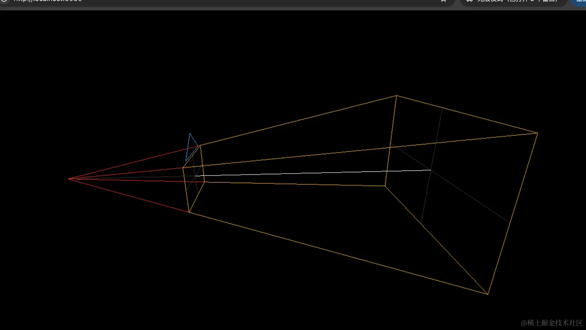

# 查看视椎体

## CameraHelper 来画视椎体

+ 要看视椎体的话，我们需要创建另一个相机，用这个相机来观察

+ CameraHelper

  ```js
  // 视椎体
  import * as THREE from 'three';
  import {
    OrbitControls
  } from 'three/addons/controls/OrbitControls.js';

  const scene = new THREE.Scene();

  const axesHelper = new THREE.AxesHelper(200);
  scene.add(axesHelper);

  const width = window.innerWidth;
  const height = window.innerHeight;

  const camera = new THREE.PerspectiveCamera(60, width / height, 1, 1000);
  camera.position.set(200, 200, 200);
  camera.lookAt(0, 0, 0);

  const renderer = new THREE.WebGLRenderer();
  renderer.setSize(width, height)

  function render() {
    renderer.render(scene, camera);
    requestAnimationFrame(render);
  }

  render();

  document.body.append(renderer.domElement);

  const controls = new OrbitControls(camera, renderer.domElement);
  ```

  ```js
  // 查看视椎体
  const camera2 = new THREE.PerspectiveCamera(20, 16 / 9, 100, 300);
  const cameraHelper = new THREE.CameraHelper(camera2);
  scene.add(cameraHelper);
  ```

  
