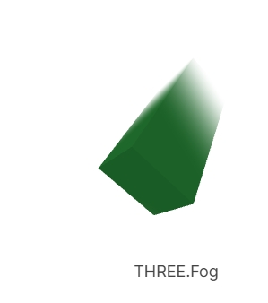

# THREE.Fog

## 概述

+ `THREE.Fog` 代表线性雾，它是一种基于距离的雾效
+ 随着物体离相机越来越远，它们逐渐被雾的颜色所取代

  + 让你设定 `near` 和 `far` 属性，代表距离摄像机的距离
  + 任何物体比 `near` 近不会受到影响，任何物体比 `far` 远则完全是雾的颜色
  + 在 `near` 和 `far` 中间的物体，会从它们自身材料的颜色褪色到雾的颜色

  

## 构造函数

+ `const fog = new THREE.Fog(color, near, far);`

  + color (0x000000)：雾的颜色，通常是一个十六进制颜色值
  + near (1)：雾开始影响物体的距离，单位为世界坐标系中的单位长度
  + far (1000)：雾完全覆盖物体的距离

  ```js
  // 创建了一个灰色的线性雾，当物体距离相机超过 10 个单位时开始受到影响，直到 500 个单位时完全被雾覆盖
  const scene = new THREE.Scene();
  {
    const color = 0xFFFFFF;  // white
    const near = 10;
    const far = 500;
    scene.fog = new THREE.Fog(color, near, far);
  }
  ```


