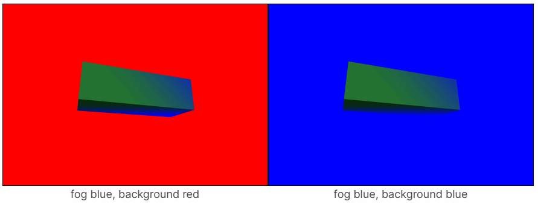

# 雾的作用

## 概述

+ 雾是作用在 渲染的物体 上的，是物体颜色中每个像素计算的一部分
+ 这意味着如果你想让你的场景褪色到某种颜色，你需要设定雾 和 场景的背景颜色为同一种颜色
+ 背景颜色通过 `scene.background` 属性设置
+ 你可以通过 `THREE.Color` 选择背景颜色设置

  ```js
  scene.background = new THREE.Color('#F00');  // red
  ```

  ```js
  const scene = new THREE.Scene();

  {
    const near = 1;
    const far = 2;
    const color = 'lightblue';
    scene.fog = new THREE.Fog(color, near, far);
    scene.background = new THREE.Color(color);
  }
  ```

  
