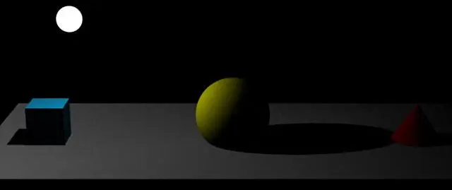

# 点光源设置 PointLight

## 概述

+ 点光源 `PointLight` 可以类比为一个发光点，就像生活中一个灯泡以灯泡为中心向四周发射光线
+ 该光源可以投射阴影

+ 并且可以根据距离衰减
+ 用途：用于模拟近距离的光源，例如灯泡、蜡烛等

  
  

  ```js
  //点光源：两个参数分别表示光源颜色和光照强度

  // 参数1：0xffffff是纯白光,表示光源颜色
  // 参数2：1.0,表示光照强度，可以根据需要调整
  const pointLight = new THREE.PointLight(0xffffff, 1.0);

  pointLight.position.set(0, 10, 0); // 设置光源位置
  scene.add(pointLight);
  ```

## 构造器

+ `PointLight( color : Color, intensity : Float, distance : Number, decay : Float )`

  + color -（可选）一个表示颜色的Color 的实例、字符串或数字，默认为一个白色（0xffffff）的 Color 对象
  + intensity -（可选）光照强度。默认值为 1
  + distance - 光源照射的最大距离。默认值为 0（无限远）
  + decay - 沿着光照距离的衰退量。默认值为 2

## 使用场景

+ 室内照明：模拟房间内的灯泡或吊灯
+ 星星：模拟夜空中星星的光芒
+ 灯笼：模拟手持灯笼或节日装饰灯
+ 动态光源：用于创建动态光源效果，如移动的火把或闪烁的灯

## 注意事项

+ 衰减：点光源的衰减方式可以通过 decay 参数来设置

  + 默认情况下，点光源采用平方衰减，即光强随距离的平方衰减
  + 这种衰减方式更符合物理现实

+ 阴影：点光源可以产生阴影，但启用阴影会增加渲染开销。如果需要启用阴影，需要设置 pointLight.castShadow 为 true，并且还需要配置阴影映射器的相关属性
+ 光照模型：点光源在不同的光照模型中可能表现不同。例如，THREE.MeshStandardMaterial 和 THREE.MeshPhysicalMaterial 等现代材质支持物理正确的光照模型，会更真实地处理点光源的影响