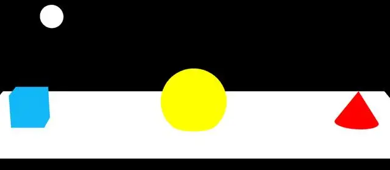

# 环境光设置 AmbientLight

## 概述

+ 环境光 `AmbientLight` 没有特定方向（会均匀的照亮场景中的所有物体），只是整体改变场景的光照明暗

+ 环境光不产生阴影，也不考虑物体表面的方向，因此它主要用于提供基础的亮度
+ 确保即使在没有其他光源的情况下，物体也有一定的可见性
+ 这种光源非常适合用于**补充其他定向光源**，一般都是环境光结合点光源、平行光来一起用，以避免场景过于黑暗

  

## 构造函数

+ `AmbientLight( color : Color, intensity : Float )`

  + color -（可选）一个表示颜色的 Color 的实例、字符串或数字，默认为一个白色（0xffffff）的 Color 对象
  + intensity -（可选）光照的强度

    + 默认值为 1

+ 创建一个环境光对象

  ```js
  //环境光:没有特定方向，整体改变场景的光照明暗
  const ambient = new THREE.AmbientLight(0xffffff, 0.4);
  scene.add(ambient);
  ```

## 使用场景

+ 基础照明：为场景提供一个最低限度的基础照明，防止场景在没有其他光源时变得完全黑暗
+ 补充照明：与其他光源一起使用，以增加场景的层次感和深度。例如，环境光可以用来减轻强烈定向光造成的阴影区域过暗的问题
+ 模拟漫反射：尽管环境光并不真正模拟漫反射，但它可以在视觉上起到类似的作用，使得物体表面看起来更加均匀

## 注意事项

+ 阴影：环境光不会产生阴影，因此如果你需要阴影效果，必须使用其他类型的光源（如 THREE.DirectionalLight 或 THREE.PointLight）

+ 光照模型：环境光在不同的光照模型中可能表现不同

  + 例如，`THREE.MeshStandardMaterial` 和 `THREE.MeshPhysicalMaterial` 等现代材质支持物理正确的光照模型，会更真实地处理环境光的影响

+ 性能考虑：环境光相对简单，对性能的影响较小，因此可以放心地用于大多数场景中
