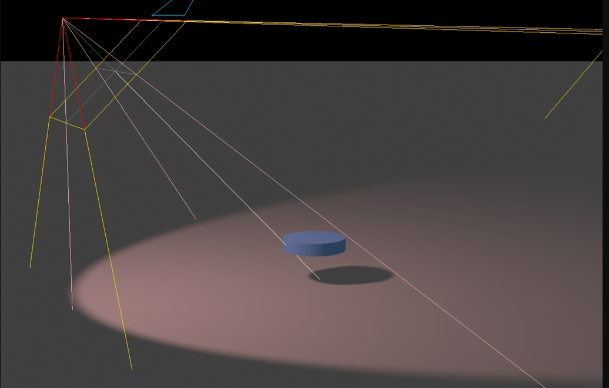

# 聚光灯光源 SpotLight

## 概述

+ 是一种从一个点向特定方向发射锥形光线的光源
+ 它可以产生阴影
+ 常用于模拟手电筒、台灯、舞台灯光等效果

  
  

## SpotLight 构造器

+ 聚光源可以认为是一个沿着特定方会逐渐发散的光源，照射范围在三维空间中构成一个圆锥体

+ `SpotLight( color : Integer, intensity : Float, distance : Float, angle : Radians, penumbra : Float, decay : Float )`

  + `color` - (可选参数) 十六进制光照颜色

    + 默认值 0xffffff (白色)

  + `intensity` - (可选参数) 光照强度

    + 默认值 1

  + `distance` - 从光源发出光的最大距离，其强度根据光源的距离线性衰减

    + 默认值为 0（无限远）

  + `angle` - 光线散射角度

    + 默认值为 `Math.PI/3` )
    + 最大为 `Math.PI/2`

  + `penumbra` - 聚光锥的半影衰减百分比

    + 在0和1之间的值
    + 默认为0

  + `decay` - 沿着光照距离的衰减量

    + 默认值为 2

  ```js
  // 聚光源
  // 0xffffff:光源颜色
  // 1.0：光照强度intensity
  const spotLight = new THREE.SpotLight(0xffffff, 1.0);
  scene.add(spotLight);//光源添加到场景中
  ```

+ 光照强度也可以不通过 `THREE.SpotLight` 参数2设置，直接通过光照强度属性 `.intensity` 设置

  ```js
  spotLight.intensity = 1.0;//光照强度
  ```

## 聚光源发散角度 .angle

+ 通过属性 `.angle` 可以设置聚光源发散角度，和目标 `.target` 两个属性来实现

  ```js
  // 设置聚光光源发散角度
  spotLight.angle = Math.PI / 6;//光锥角度的二分之一
  ```

## 聚光源位置 .position

+ 聚光源 `SpotLight` 的父类是 `Light` ，Light的父类是 `Object3D`
+ 聚光源 `SpotLight` 会继承父类 `Object3D` 的位置属性 `.position`

  ```js
  // 设置聚光光源位置
  spotLight.position.set(0, 50, 0);
  ```

## 聚广源目标对象 .target

+ 聚广源照射的方向

+ 聚广源目标对象 `.target` 和光源的位置 `.position` 共同确定聚广源照射方向

+ 浏览器控制台打印聚广源目标对象 `.target` 属性，可以看到属性值是一个模型对象 `Object3D`

  ```js
  console.log('聚广源指向目标',spotLight.target);
  ```

+ 聚广源目标对象属性的位置通过属性值Object3D的 `.position` 属性设置（*默认在坐标原点*）

  ```js
  // spotLight.target 是一个模型对象Object3D，默认在坐标原点
  spotLight.target.position.set(50,0,0);

  //spotLight.target添加到场景中.target.position才会起作用
  scene.add(spotLight.target);
  ```

## 使用场景

+ 舞台灯光：模拟舞台上的聚光灯效果，突出舞台上的演员或道具
+ 手电筒：模拟手电筒或头灯的效果，用于照亮前方的一片区域
+ 汽车前灯：模拟汽车前灯的效果，照亮前方的道路

## 注意事项

+ 阴影：如果要启用阴影功能，需要设置 spotLight.castShadow 为 true，并且还需要配置阴影映射器的相关属性，如 shadow.bias、shadow.mapSize 等
+ 光照模型：聚光灯在不同的光照模型中可能表现不同。例如，THREE.MeshStandardMaterial 和 THREE.MeshPhysicalMaterial 等现代材质支持物理正确的光照模型，会更真实地处理聚光灯的影响
+ 性能考虑：启用阴影会增加渲染开销，特别是在高分辨率阴影映射的情况下。因此，在性能敏感的应用中，需要权衡阴影质量和渲染性能

## 示例

+ 示例

  ```js
  //场景
  const scene = new THREE.Scene();

  // 材质
  const mesh = (() => {
    const group = new Group();
    const geometry = new PlaneGeometry( 200, 100,);
    const material = new MeshLambertMaterial( {color: 0x00ffff} );
    const plane = new Mesh( geometry, material );
    plane.rotation.x = -Math.PI / 2;
    group.add( plane );
  })();

  scene.add(mesh); //模型对象添加到场景中

  //光源设置
  (() => {
    const ambient = new THREE.AmbientLight(0xffffff, 0.4);
    scene.add(ambient);

    // 聚光源
    const spotLight = new THREE.SpotLight(0xffffff,1.0);
    scene.add(spotLight);//光源添加到场景中
    // 设置聚光光源发散角度
    spotLight.angle = Math.PI/6;//光锥角度的二分之一
    // 设置聚光光源位置
    spotLight.position.set(0, 50, 0);

    console.log('聚广源指向目标',spotLight.target);
    // spotLight.target是一个模型对象Object3D，默认在坐标原点
    spotLight.target.position.set(0,0,0);
    //spotLight.target添加到场景中.target.position才会起作用
    scene.add(spotLight.target);

    // 聚广源 辅助对象
    const spotLightHelper = new THREE.SpotLightHelper(spotLight,0xffffff)
    scene.add(spotLightHelper);
  })():

  //相机
  const width = window.innerWidth;
  const height = window.innerHeight;
  const camera = new THREE.PerspectiveCamera(30, width / height, 1, 3000);
  camera.position.set(292, 223, 185);
  camera.lookAt(0, 0, 0);

  // WebGL渲染器设置
  const renderer = new THREE.WebGLRenderer({
    antialias: true, //开启优化锯齿
  });
  renderer.setPixelRatio(window.devicePixelRatio); //防止输出模糊
  renderer.setSize(width, height);
  document.body.appendChild(renderer.domElement);

  // 渲染循环
  function render() {
    renderer.render(scene, camera);
    requestAnimationFrame(render);
  }
  render();

  const controls = new OrbitControls(camera, renderer.domElement);

  // 画布跟随窗口变化
  window.onresize = function () {
    renderer.setSize(window.innerWidth, window.innerHeight);
    camera.aspect = window.innerWidth / window.innerHeight;
    camera.updateProjectionMatrix();
  };
  ```
