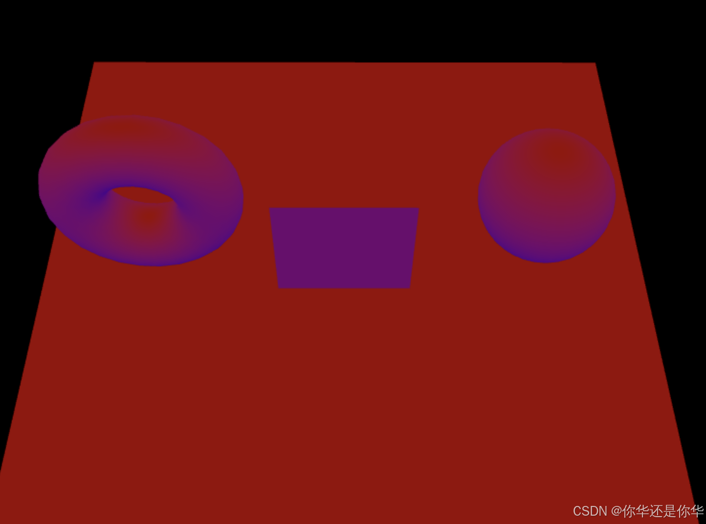
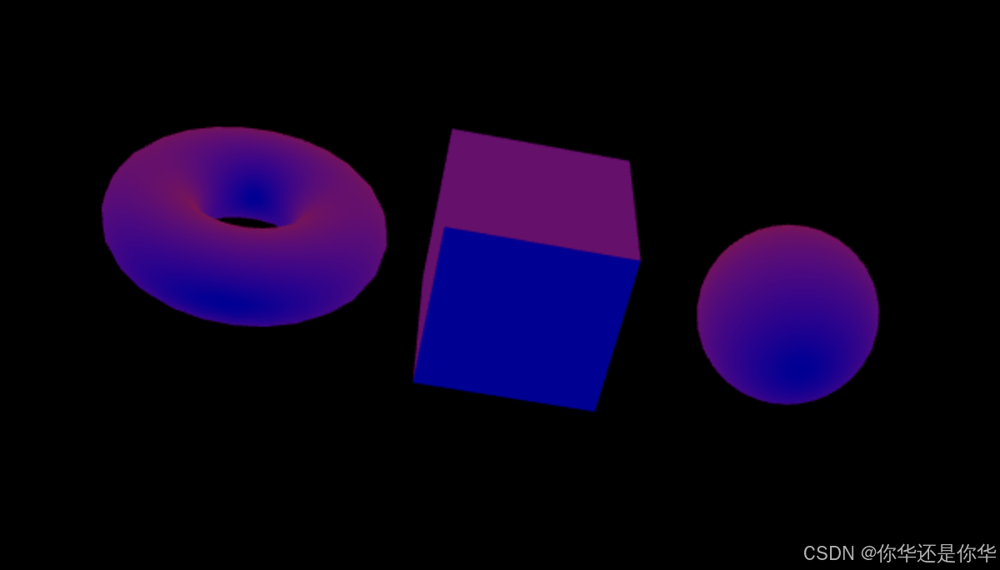

# HemisphereLight 半球光

## 概述

+ 半球光有两个颜色，一个是天光（上方），一个是地光（下方），没有阴影
+ 用途：用于提供柔和的全局光照效果，适合用于户外场景，模拟天空和地面的光照
+ 属性：主要包括天空的颜色（skyColor）和地面的颜色（groundColor），以及强度

  ```js
  const geometry = new THREE.TorusGeometry( 1, 0.5, 20, 25 );
  const material = new THREE.MeshStandardMaterial();
  const torus = new THREE.Mesh( geometry, material );
  torus.position.set(-3,2,0)

  // 掉之前光照后再加入如下代码
  const light = new THREE.HemisphereLight( 0xff0000, 0x0000ff, 1 );
  scene.add( light );
  ```

  
  

## 构造函数

+ `new THREE.HemisphereLight(skyColor, groundColor, intensity)`

  + skyColor - 天空光源的颜色，通常是一个整数，表示十六进制颜色值。默认值为 0x0000ff（蓝色）
  + groundColor - 地面光源的颜色，通常是一个整数，表示十六进制颜色值。默认值为 0x030303（接近黑色）
  + intensity - 光的强度，是一个浮点数，默认值为 1

  ```js
  // 创建一个半球光
  var hemisphereLight = new THREE.HemisphereLight(0x0000ff, 0x7f7f7f, 1.0); // 天空蓝色，地面灰色，强度1.0
  scene.add(hemisphereLight);
  ```

## 属性

+ 半球光有几个重要的属性：

  + color - 天空光源的颜色
  + groundColor - 地面光源的颜色
  + intensity - 光的强度，可以用来调节半球光的整体亮度

## 方法

+ 半球光继承自 THREE.Light 类，因此可以使用一些通用的方法，如：

  + clone() - 返回一个新的、克隆的 THREE.HemisphereLight 实例

## 使用场景

+ 模拟自然光照：半球光非常适合用来模拟自然环境中的光照条件，例如白天或黄昏时的光照效果
+ 基础照明：它可以作为基础光源来提供整体的光照效果，为场景中的物体提供基本的照明
+ 补充照明：与其他光源（如定向光、点光源等）结合使用，以增加场景的层次感和深度

## 注意事项

+ 阴影：半球光不会产生阴影，因为它是基于一个半球形的光源，没有明确的方向

+ 光照模型：在使用支持物理正确光照模型的材质（如 THREE.MeshStandardMaterial 或 THREE.MeshPhysicalMaterial）时，半球光的效果会更加逼真

+ 性能考虑：半球光相对简单，对性能的影响较小，因此可以放心地用于大多数场景中

## 示例

+ 示例 创建了一个半球光并设置了天空和地面的颜色以及强度。我们还在场景中添加了一个立方体和一个地面平面，并通过渲染循环使其旋转，以便展示半球光的效果

  ```js
  // 创建场景
  var scene = new THREE.Scene();

  // 创建相机
  var camera = new THREE.PerspectiveCamera(75, window.innerWidth / window.innerHeight, 0.1, 1000);
  camera.position.z = 5;

  // 创建渲染器
  var renderer = new THREE.WebGLRenderer();
  renderer.setSize(window.innerWidth, window.innerHeight);
  document.body.appendChild(renderer.domElement);

  // 创建半球光
  var hemisphereLight = new THREE.HemisphereLight(0x0000ff, 0x7f7f7f, 1.0); // 天空蓝色，地面灰色，强度1.0
  scene.add(hemisphereLight);

  // 创建一个立方体
  var geometry = new THREE.BoxGeometry(1, 1, 1);
  var material = new THREE.MeshStandardMaterial({ color: 0x00ff00 });
  var cube = new THREE.Mesh(geometry, material);
  scene.add(cube);

  // 创建一个地面平面
  var planeGeometry = new THREE.PlaneGeometry(20, 20, 1, 1);
  var planeMaterial = new THREE.MeshStandardMaterial({ color: 0x808080 });
  var plane = new THREE.Mesh(planeGeometry, planeMaterial);
  plane.rotation.x = -Math.PI / 2;
  plane.position.y = -0.5;
  scene.add(plane);

  // 渲染函数
  function animate() {
      requestAnimationFrame(animate);

      // 旋转立方体
      cube.rotation.x += 0.01;
      cube.rotation.y += 0.01;

      renderer.render(scene, camera);
  }
  animate();
  ```
