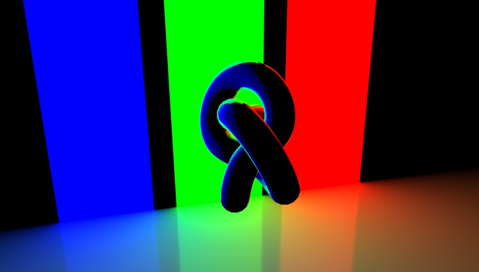

# RectAreaLight 矩形区域光

## 概述

+ 它模拟了一个矩形区域光源，可以用来创建柔和的阴影效果
+ 这种光源非常适合用于模拟灯箱、LED 屏幕、霓虹灯管等具有较大面积的光源
+ 与点光源相比，矩形区域光源能够产生更加自然的阴影过渡，从而增强场景的真实感

  

## 构造函数

+ `new THREE.RectAreaLight(color, intensity, width, height)`

  + color - 光的颜色，通常是一个整数，表示十六进制颜色值。默认值为 0xffffff（白色）
  + intensity - 光的强度，是一个浮点数，默认值为 1
  + width - 光源的宽度
  + height - 光源的高度

  ```js
  var rectAreaLight = new THREE.RectAreaLight(0xffffff, 1.0, 10, 10); // 白色，强度1.0，宽度10，高度10
  rectAreaLight.position.set(0, 10, 0); // 设置光源位置
  rectAreaLight.lookAt(new THREE.Vector3()); // 设置光源方向
  scene.add(rectAreaLight);
  ```

## 使用场景

+ 灯箱：模拟广告灯箱或摄影棚中的柔光箱
+ LED 屏幕：模拟大型LED显示屏的光照效果
+ 霓虹灯：模拟霓虹灯管的光照效果
+ 室内照明：模拟房间内的壁灯或顶灯，尤其是那些具有较大面积的灯具

## 注意事项

+ 光照模型：矩形区域光源在不同的光照模型中可能表现不同。例如，THREE.MeshStandardMaterial 和 THREE.MeshPhysicalMaterial 等现代材质支持物理正确的光照模型，会更真实地处理矩形区域光源的影响
+ 性能考虑：启用较大的矩形区域光源会增加渲染开销，尤其是在需要高分辨率阴影的情况下。因此，在性能敏感的应用中，需要权衡光源大小和渲染性能
+ 阴影：矩形区域光源可以产生更加柔和和自然的阴影效果，但需要注意光源的大小和位置，以获得最佳效果
