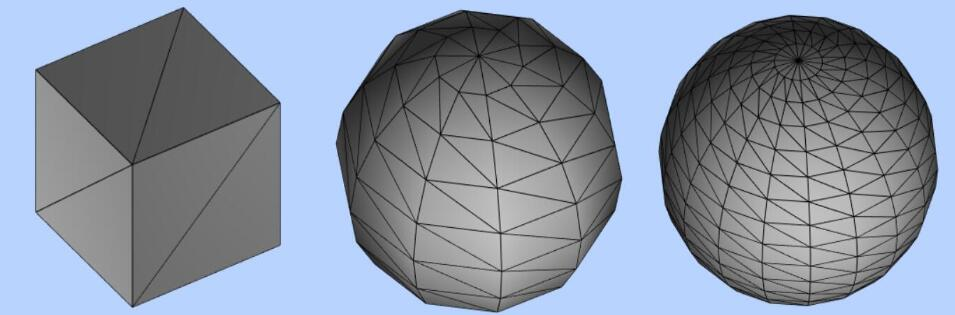

# 网络模型中的三角形

## 网格模型Mesh

+ 网格模型Mesh其实就一个一个三角形(面)拼接构成
+ 使用网格模型Mesh渲染几何体geometry，就是几何体所有顶点坐标三个为一组，构成一个三角形，多组顶点构成多个三角形，就可以用来模拟表示物体的表面

  

+ 3D 里所有的物体都是三角形组成的，也就是网格模型

## 三角形数量与性能

+ 对于一个曲面而言，细分数越大，表面越光滑，但是三角形和顶点数量却越多

+ 几何体三角形数量或者说顶点数量直接影响Three.js的渲染性能，在不影响渲染效果的情况下，一般尽量越少越好

  

## 几何体细分数

+ Three.js很多几何体都提供了细分数相关的参数，这里以矩形平面几何体PlaneGeometry为例介绍

+ 矩形平面几何体至少需要两个三角形拼接而成

  ```js
  //矩形几何体PlaneGeometry的参数3,4表示细分数，默认是1,1

  const geometry = new THREE.PlaneGeometry(100,50,1,1);
  ```

+ 把一个矩形分为2份，每个矩形2个三角形，总共就是4个三角形

  ```js
  const geometry = new THREE.PlaneGeometry(100,50,2,1);
  ```

+ 把一个矩形分为4份，每个矩形2个三角形，总共就是8个三角形

  ```js
  const geometry = new THREE.PlaneGeometry(100,50,2,2);
  ```

## 球体SphereGeometry细分数

+ 球体SphereGeometry参数2、3分别代表宽、高度两个方向上的细分数，默认32,16，具体多少以你所用版本为准

  ```js
  const geometry = new THREE.SphereGeometry( 50, 32, 16 );
  ```

+ 如果球体细分数比较低，表面就不会那么光滑

  ```js
  const geometry = new THREE.SphereGeometry( 15, 8, 8 );
  ```
