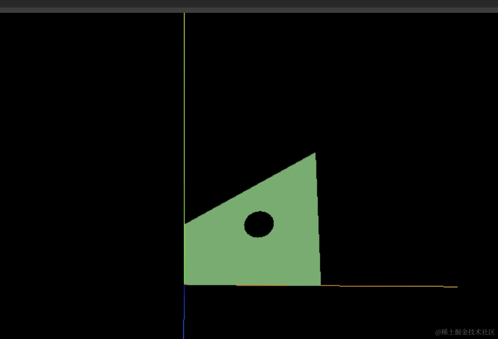

# Shape

## 概述

+ 使用路径以及可选的孔洞来定义一个二维形状平面

+ 它可以和 `ExtrudeGeometry` 、 `ShapeGeometry` 一起使用，获取点，或者获取三角面

  ```js
  const heartShape = new THREE.Shape();

  heartShape.moveTo( 25, 25 );
  heartShape.bezierCurveTo( 25, 25, 20, 0, 0, 0 );
  heartShape.bezierCurveTo( - 30, 0, - 30, 35, - 30, 35 );
  heartShape.bezierCurveTo( - 30, 55, - 10, 77, 25, 95 );
  heartShape.bezierCurveTo( 60, 77, 80, 55, 80, 35 );
  heartShape.bezierCurveTo( 80, 35, 80, 0, 50, 0 );
  heartShape.bezierCurveTo( 35, 0, 25, 25, 25, 25 );

  const extrudeSettings = { depth: 8, bevelEnabled: true, bevelSegments: 2, steps: 2, bevelSize: 1, bevelThickness: 1 };

  const geometry = new THREE.ExtrudeGeometry( heartShape, extrudeSettings );

  const mesh = new THREE.Mesh( geometry, new THREE.MeshPhongMaterial() );
  ```

## 构造函数

+ `Shape( points : Array )`

  + points -- (optional) 一个Vector2数组

+ 从点来创建一个Shape。第一个点定义了偏移量， 接下来的点被作为LineCurves加入到curves中

+ 如果没有点被指定，一个空的形状将会被创建，且 `.currentPoint` 将会被设为原点

## 属性

+ 共有属性请参见其基类Path

+ .uuid : String

  + 该类所创建的实例的UUID
  + 它是自动被指定的，因此它不应当被编辑、更改

+ .holes : Array

  + 一个paths数组，定义了形状上的孔洞。

## 方法

+ 共有方法请参见其基类Path。

+ .extractPoints ( divisions : Integer ) : Array

  + divisions -- 结果的精细程度（细分数）

  + 在形状以及.holes（孔洞）数组上调用getPoints，并返回一个来自于：

    ```js
    {
      shape
      holes
    }
    ```

  + 的对象，其中的形状和孔洞是Vector2数组。

+ .getPointsHoles ( divisions : Integer ) : Array

  + divisions -- 结果的精细程度（细分数）

  + 获取一个表示形状上的孔洞的Vector2s数组

## shape.holes 可以定义内孔

+ shape 挖空

  ```js
  const path = new THREE.Path();
  path.arc(50, 50, 10);
  shape.holes.push(path);
  ```

  

+ 示例

  ```js
  const pointsArr = [
    new THREE.Vector2(100, 0),
    new THREE.Vector2(50, 20),
    new THREE.Vector2(0, 0),
    new THREE.Vector2(0, 50),
    new THREE.Vector2(50, 100)
  ];

  const shape = new THREE.Shape(pointsArr);

  const path = new THREE.Path();
  path.arc(50, 50, 10);
  shape.holes.push(path);


  const geometry = new THREE.ShapeGeometry(shape);
  const material = new THREE.MeshLambertMaterial({
    color: new THREE.Color('lightgreen')
  });

  const mesh = new THREE.Mesh(geometry, material);

  export default mesh;
  ```
