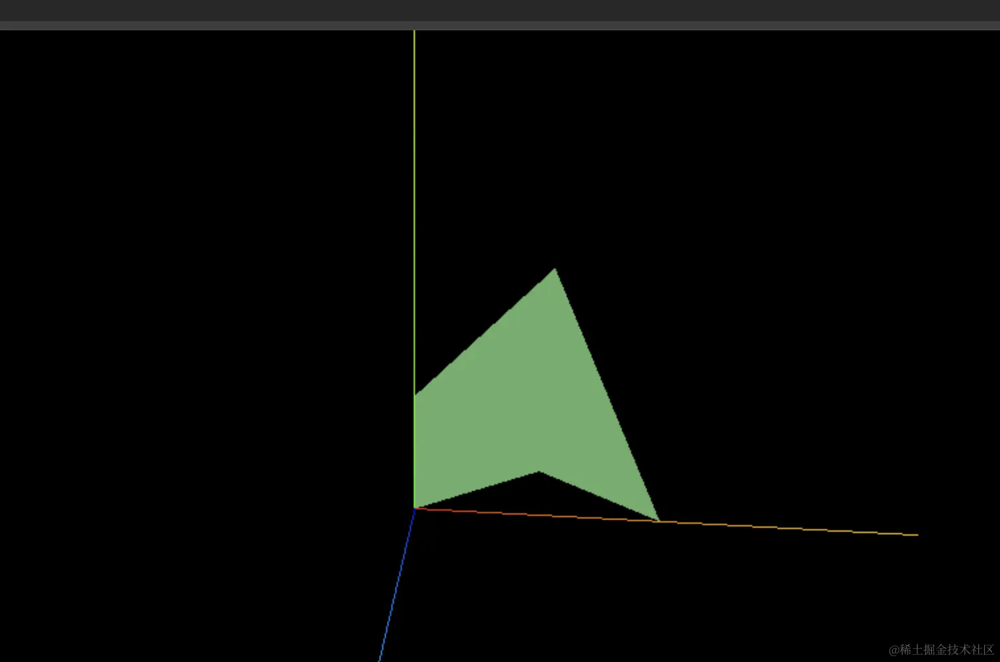
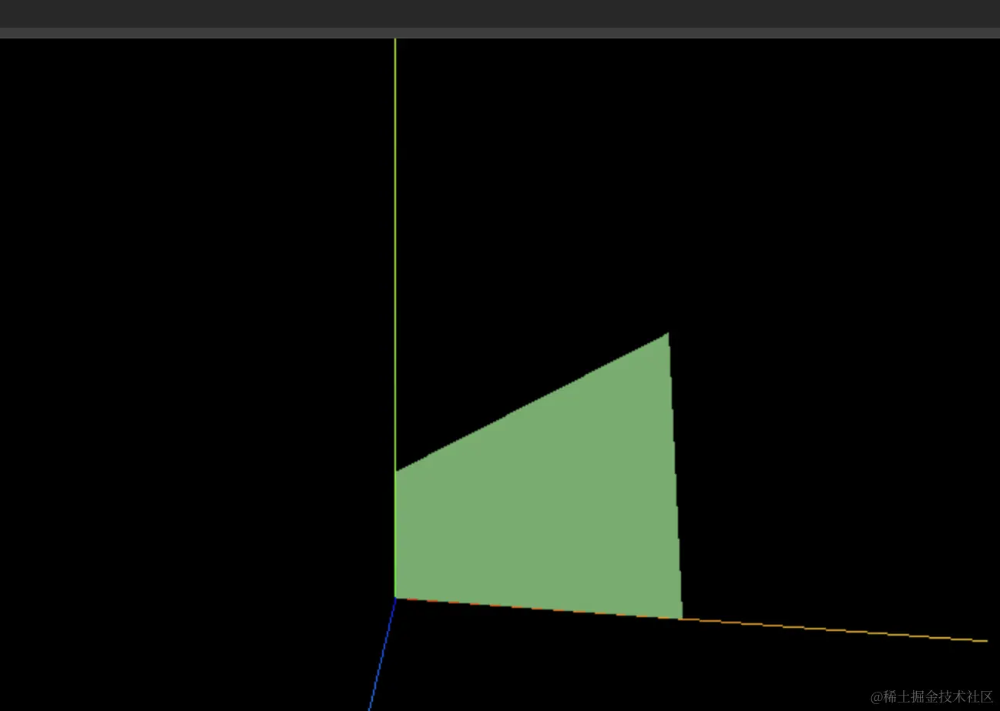

# Shape + ShapeGeometry

## 方式1：通过 Shape 定义多边形

+ 方式1：通过 Shape 定义多边形

  + 5 个点连成了一个形状 Shape ，然后用 ShapeGeometry 画出来

  ```js
  // 方式1
  import * as THREE from 'three';

  const pointsArr = [
    new THREE.Vector2(100, 0),
    new THREE.Vector2(50, 20),
    new THREE.Vector2(0, 0),
    new THREE.Vector2(0, 50),
    new THREE.Vector2(50, 100)
  ];

  const shape = new THREE.Shape(pointsArr);

  const geometry = new THREE.ShapeGeometry(shape);
  const material = new THREE.MeshLambertMaterial({
    color: new THREE.Color('lightgreen')
  });

  const mesh = new THREE.Mesh(geometry, material);

  export default mesh;
  ```


  

## 方式2：通过 Shape 定义多边形

+ 方式2：通过 Shape 定义多边形

  ```js
  // 方式2
  const shape = new THREE.Shape();
  shape.moveTo(100, 0);
  shape.lineTo(0, 0);
  shape.lineTo(0, 50);
  shape.lineTo(80, 100);
  ```

  
