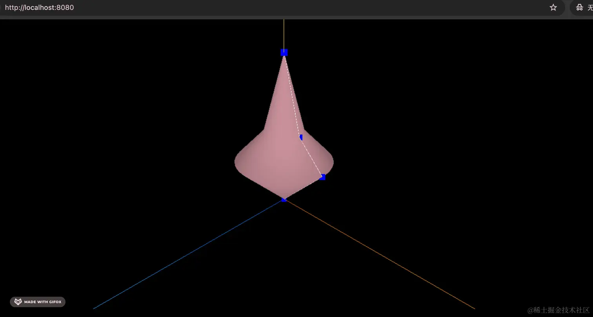
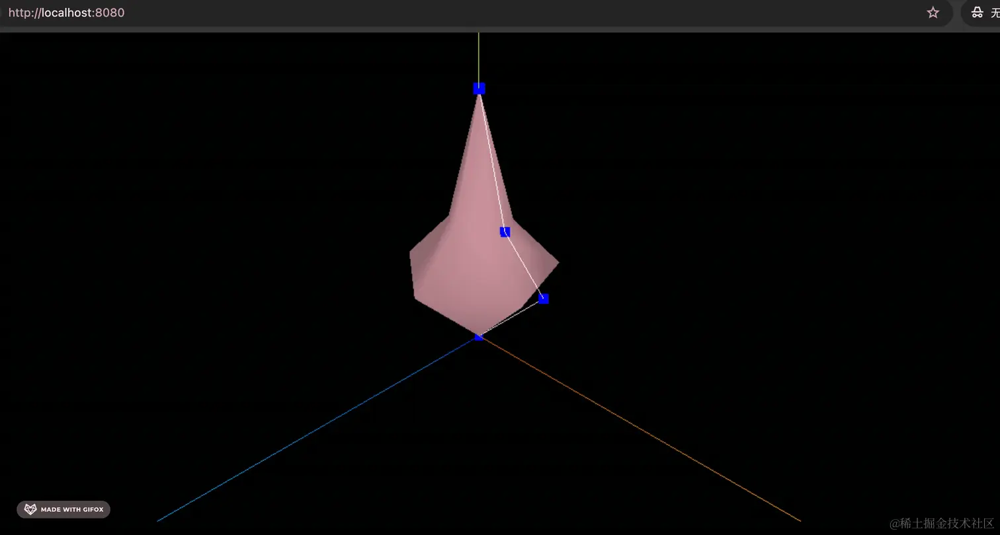

# 车削缓冲几何体 LatheGeometry

## 概述

+ 创建具有轴对称性的网格，比如花瓶
+ 车削绕着Y轴来进行旋转

  

  ```js
  const points = [];
  for ( let i = 0; i < 10; i ++ ) {
    points.push( new THREE.Vector2( Math.sin( i * 0.2 ) * 10 + 5, ( i - 5 ) * 2 ) );
  }
  const geometry = new THREE.LatheGeometry( points );
  const material = new THREE.MeshBasicMaterial( { color: 0xffff00 } );
  const lathe = new THREE.Mesh( geometry, material );
  scene.add( lathe );
  ```

## 构造器

+ `LatheGeometry(points : Array, segments : Integer, phiStart : Float, phiLength : Float)`

+ 参数

  + points — 一个Vector2对象数组

    + 每个点的X坐标必须大于0。默认值 (0,-0.5), (0.5,0) and (0,0.5) which creates a simple diamond shape

      

      ```js
      // 创建了 4 个点，让它用这条曲线绕 y 轴旋转一周，形成一个几何体
      const pointsArr = [
        new THREE.Vector2(0, 0),
        new THREE.Vector2(50, 50),
        new THREE.Vector2(20, 80),
        new THREE.Vector2(0, 150)
      ];
      ```

  + segments — 要生成的车削几何体圆周分段的数量，默认值是12

    

  + phiStart — 以弧度表示的起始角度，默认值为0
  + phiLength — 车削部分的弧度（0-2PI）范围，2PI将是一个完全闭合的、完整的车削几何体，小于2PI是部分的车削。默认值是2PI

+ 基于参数创建一个LatheGeometry

## 属性

+ 共有属性请参见其基类BufferGeometry

+ `.parameters : Object`

  + 一个包含着构造函数中每个参数的对象。在对象实例化之后，对该属性的任何修改都不会改变这个几何体。

## 方法(Methods)

+ 共有方法请参见其基类BufferGeometry
