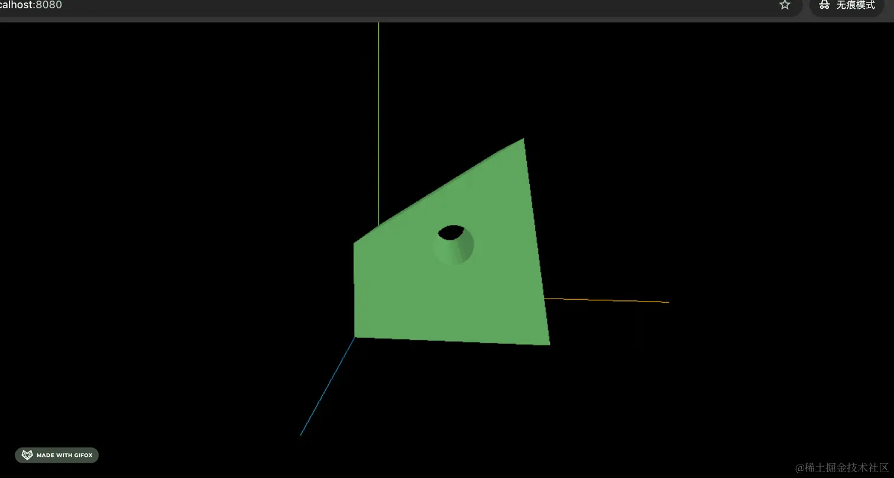

# Shape + ExtrudeGeometry

## code

+ 有了多边形之后，那是不是沿着某个方向拉伸一下，就是一个新的几何体

  ```js
  const geometry = new THREE.ExtrudeGeometry(shape, {
    depth: 100
  });
  ```

  

  ```js
  import * as THREE from 'three';

  const pointsArr = [
    new THREE.Vector2(100, 0),
    new THREE.Vector2(50, 20),
    new THREE.Vector2(0, 0),
    new THREE.Vector2(0, 50),
    new THREE.Vector2(50, 100)
  ];

  const shape = new THREE.Shape(pointsArr);

  // const geometry = new THREE.ShapeGeometry(shape);

  // 挖空
  const path = new THREE.Path();
  path.arc(50, 50, 10);
  shape.holes.push(path);

  const geometry = new THREE.ExtrudeGeometry(shape, {
    depth: 100
  });

  const material = new THREE.MeshLambertMaterial({
    color: new THREE.Color('lightgreen')
  });

  const mesh = new THREE.Mesh(geometry, material);

  export default mesh;
  ``
