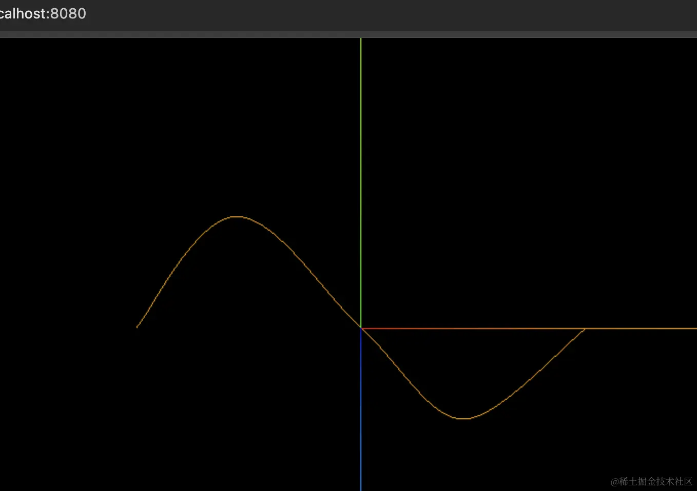
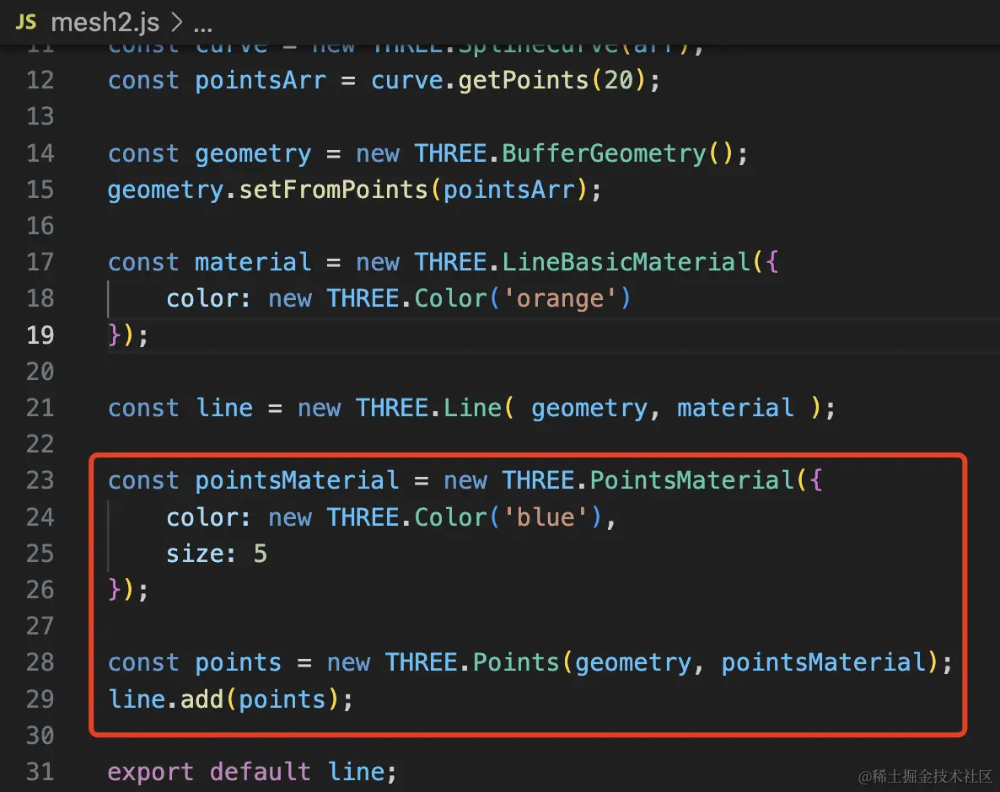
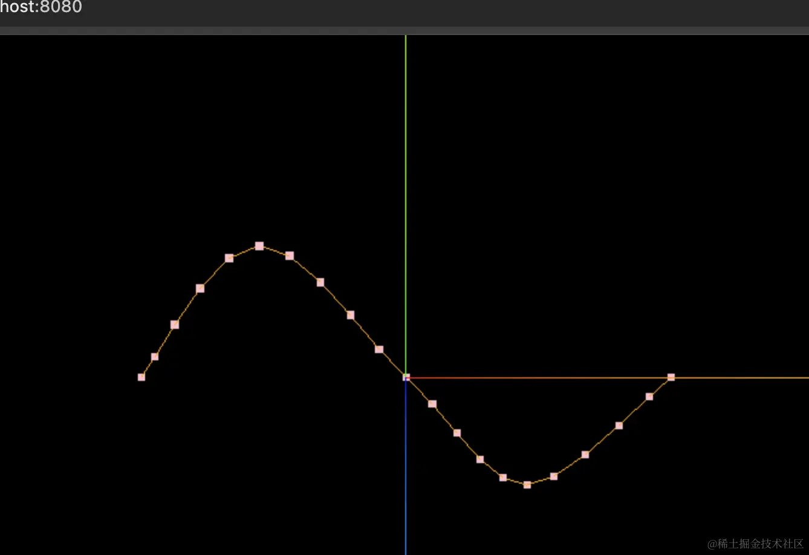

# SplineCurve 二维样条曲线

## 概述

+ 从一系列的点中(任意的一堆点连起来的曲线)，创建一个平滑的二维样条曲线

+ 内部使用Interpolations.CatmullRom来创建曲线

  ```js

  ```

## 构造函数

+ `SplineCurve( points : Array )`

  + points – 定义曲线的 `Vector2` 点的数组

## 属性

+ 共有属性请参见其基类Curve

+ `.points : Array`

  + 定义这一曲线的Vector2点的数组

## 方法

+ 共有方法请参见其基类Curve

## 示例

+ 示例1

  ```js
  import * as THREE from 'three';

  const arr = [
    new THREE.Vector2( -100, 0 ),
    new THREE.Vector2( -50, 50 ),
    new THREE.Vector2( 0, 0 ),
    new THREE.Vector2( 50, -50 ),
    new THREE.Vector2( 100, 0 )
  ];

  const curve = new THREE.SplineCurve(arr);
  const pointsArr = curve.getPoints(20);

  const geometry = new THREE.BufferGeometry();
  geometry.setFromPoints(pointsArr);

  const material = new THREE.LineBasicMaterial({
      color: new THREE.Color('orange')
  });

  const line = new THREE.Line( geometry, material );

  export default line;
  ```

  

+ 示例2：给曲线打点

  ```js
  const pointsMaterial = new THREE.PointsMaterial({
    color: new THREE.Color('pink'),
    size: 5
  });
  const points = new THREE.Points(geometry, pointsMaterial);
  line.add(points);
  ```

  
  

+ 示例3：
