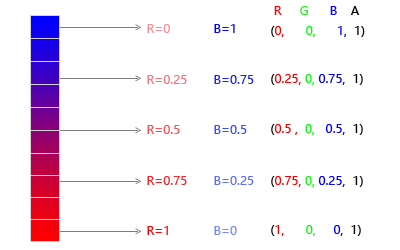
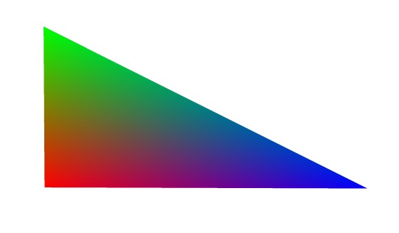

# 几何体顶点颜色数数据

## 顶点颜色.attributes.color

+ 顶点位置数据 `geometry.attributes.position`
+ 顶点法向量数据 `geometry.attributes.normal`
+ 顶点UV数据 `geometry.attributes.uv`
+ 顶点颜色数据 `geometry.attributes.color`

## 几何体顶点颜色.attributes.color

+ 几何体BufferGeometry顶点位置数据 `.attributes.position`

  ```js
  const geometry = new THREE.BufferGeometry(); //创建一个几何体对象
  const vertices = new Float32Array([
    0, 0, 0, //顶点1坐标
    50, 0, 0, //顶点2坐标
    0, 25, 0, //顶点3坐标
  ]);
  // 顶点位置
  geometry.attributes.position = new THREE.BufferAttribute(vertices, 3);
  ```

+ 与几何体BufferGeometry顶点位置数据 `.attributes.position` 一一对应的顶点颜色数据 `.attributes.color`

+ 每个点对应一个位置数据，同时对应一个颜色数据

  ```js
  const colors = new Float32Array([
    1, 0, 0, //顶点1颜色
    0, 0, 1, //顶点2颜色
    0, 1, 0, //顶点3颜色
  ]);
  // 设置几何体attributes属性的颜色color属性
  //3个为一组,表示一个顶点的颜色数据RGB
  geometry.attributes.color = new THREE.BufferAttribute(colors, 3);
  ```

## 点模型Points渲染顶点颜色数据

+ 通过点、线、网格模型渲染几何体Geometry，如果希望顶点颜色.attributes.color起作用，需要设置材质属性vertexColors:true，下面以以点模型为例给大家演示，你可以看到geometry的不同点被你设置为了不同颜色

  ```js
  // 点渲染模式
  const material = new THREE.PointsMaterial({
    // color: 0x333333,//使用顶点颜色数据，color属性可以不用设置
    vertexColors:true,//默认false，设置为true表示使用顶点颜色渲染
    size: 20.0, //点对象像素尺寸
  });
  const points = new THREE.Points(geometry, material); //点模型对象
  ```

## 颜色渐变(颜色插值)

+ 自定几何体顶点颜色数据，然后用线模型Line渲染，你可以看到直线的颜色是渐变的。

+ 下面代码两端直线，分别是红色到蓝色渐变、蓝色到绿色渐变

  ```js
  const colors = new Float32Array([
    1, 0, 0, //顶点1颜色
    0, 0, 1, //顶点2颜色
    0, 1, 0, //顶点3颜色
  ]);
  geometry.attributes.color = new THREE.BufferAttribute(colors, 3);

  const material = new THREE.LineBasicMaterial({
    vertexColors:true,//使用顶点颜色渲染
  });
  const line = new THREE.Line(geometry, material);
  ```

+ 几何体顶点颜色 `.attributes.color` 设置的直线颜色渐变效果

  
  

## 网格模型颜色渐变

+ 自定几何体顶点颜色数据，然后用网格模型Mesh渲染，和Line一样，也会产生颜色渐变效果

  ```js
  const material = new THREE.MeshBasicMaterial({
    // color: 0x333333,//使用顶点颜色数据，color属性可以不用设置
    vertexColors:true,//默认false，设置为true表示使用顶点颜色渲染
    side: THREE.DoubleSide,
  });
  const mesh = new THREE.Mesh(geometry, material);
  ```

  
