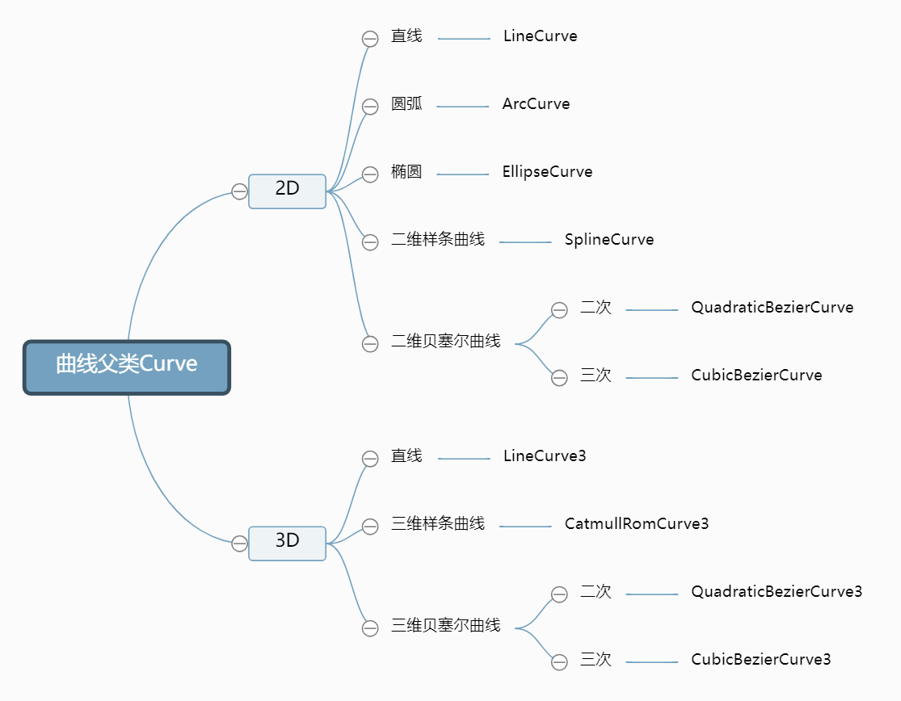
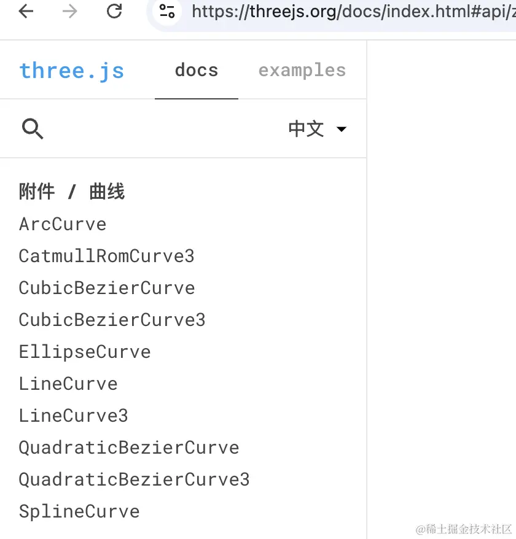

# 曲线Curve

## 概述

+ threejs提供了很多常用的曲线或直线API，可以直接使用
+ 这些API曲线都有一个共同的父类 `Curve`

+ 曲线父类Curve

  + `ArcCurve` 弧线

    + `EllipseCurve` 的别名

  + `EllipseCurve` 椭圆曲线
  + `SplineCurve` 二维样条曲线
  + `CatmullRomCurve3` 三维样条曲线
  + `CubicBezierCurve` 二维三次贝塞尔曲线
  + `CubicBezierCurve3` 三维三次贝塞尔曲线
  + `LineCurve` 二维线段曲线
  + `LineCurve3` 三维线段曲线
  + `QuadraticBezierCurve` 二维二次贝塞尔曲线
  + `QuadraticBezierCurve3` 三维二次贝塞尔曲线

  
  

