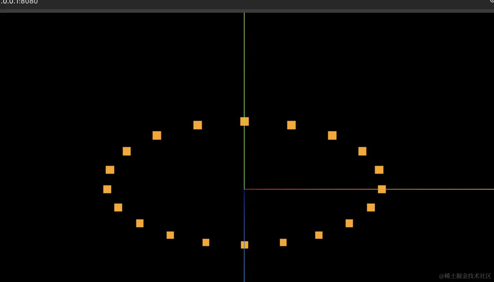
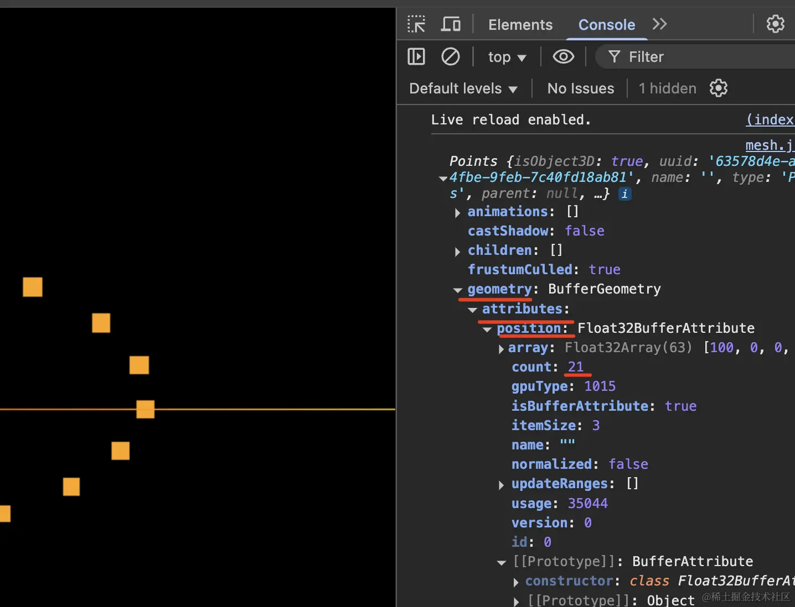
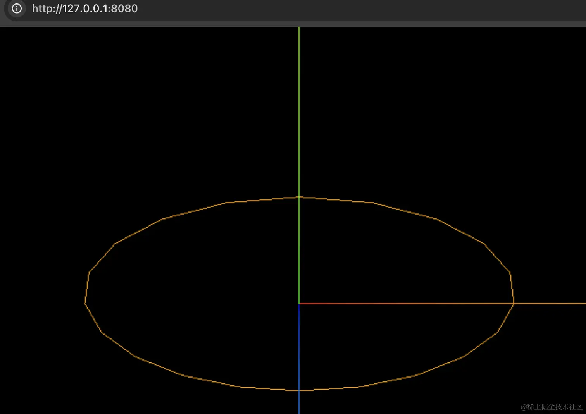
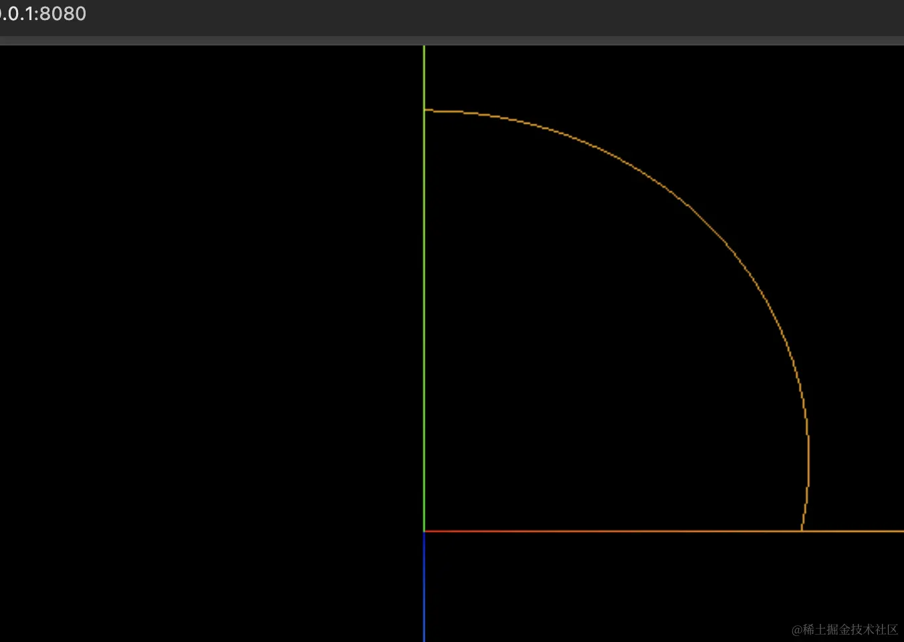

# 椭圆 EllipseCurve

## 构造函数

+ `EllipseCurve( aX, aY, xRadius,yRadius, aStartAngle, aEndAngle, aClockwise )`

  + `aX`, `aY` 椭圆中心坐标
  + `xRadius` 椭圆x轴半径
  + `yRadius` 椭圆y轴半径
  + `aStartAngle` 弧线开始角度，从x轴正半轴开始，默认0，弧度单位

    + 参数4和5表示圆弧线的起始角度，three.js默认是一个完整的圆弧，其实你也可以绘制一个半圆弧

  + `aEndAngle` 弧线结束角度，从x轴正半轴算起，默认 `2 x Math.PI` ，弧度单位
  + `aClockwise` 是否顺时针绘制，默认值为 `false`

    + 参数6默认 `false` ，逆时针绘制圆弧

      ```js
      const arc = new THREE.ArcCurve(0, 0, 100, 0, Math.PI/2,false);
      ```

    + 参数6设置为 `true` ，顺时针绘制圆弧

      ```js
      const arc = new THREE.ArcCurve(0, 0, 100, 0, Math.PI/2,true);
      ```

+ 示例

  ```js
  // 参数1和2表示椭圆中心坐标  参数3和4表示x和y方向半径
  const arc = new THREE.EllipseCurve(0, 0, 100, 50);
  ```

## 曲线精度

+ 曲线精度

  ```js
  //曲线上取点，参数表示取点细分精度
  const pointsArr = arc.getPoints(50); //分段数50，返回51个顶点
  // const pointsArr = arc.getPoints(10);//取点数比较少，圆弧线不那么光滑
  ```

## 实际使用

+ 示例1 椭圆曲线x和y方向半径相同，就是一个圆的效果

  ```js
  // 参数1和2表示椭圆中心坐标  参数3和4表示x和y方向半径
  const arc = new THREE.EllipseCurve(0, 0, 50, 50);
  ```

+ 示例2：点材质

  ```js
  import * as THREE from 'three';

  // 椭圆中心是 0,0，长短半轴长分别是 100、50
  const arc = new THREE.EllipseCurve(0, 0, 100, 50);

  // 分段数20，20 段就是 21 个点
  const pointsList = arc.getPoints(20);

  const geometry = new THREE.BufferGeometry();
  geometry.setFromPoints(pointsList);

  // 点材质
  const material = new THREE.PointsMaterial({
    color: new THREE.Color('orange'),
    size: 10
  });

  const points = new THREE.Points(geometry, material);

  export default points;
  ```

  
  

+ 示例3：线材质

  ```js
  // 线材质
  const material = new THREE.LineBasicMaterial({
    color: new THREE.Color('orange'),
  });

  const lin = new.THREE.Line(geometry, material);
  ```

  

+ 示例4：圆弧大小

  ```js
  // 完整圆弧
  const arc = new THREE.ArcCurve(0, 0, 100, 0, 2 * Math.PI);

  // 半圆弧
  const arc = new THREE.ArcCurve(0, 0, 100, 0, Math.PI);

  // 四分之一圆弧
  const arc = new THREE.ArcCurve(0, 0, 100, 0, Math.PI/2);
  ```

  

## 属性

+ 共有属性请参见其基类 `Curve`

+ `.aX : Float`

  + 椭圆的中心的X坐标

+ `.aY : Float`

  + 椭圆的中心的Y坐标

+ `.xRadius : Radians`

  + X轴向上椭圆的半径

+ `.yRadius : Radians`

  + Y轴向上椭圆的半径

+ `.aStartAngle : Float`

  + 以弧度来表示，从正右侧算起曲线开始的角度

+ `.aEndAngle : Float`

  + 以弧度来表示，从正右侧算起曲线终止的角度

+ `.aClockwise : Boolean`

  + 椭圆是否按照顺时针方向来绘制

+ `.aRotation : Float`

  + 以弧度表示，椭圆在X轴正方向逆时针的旋转角度（可选），默认值为0

## 方法

+ 共有方法请参见其基类 `Curve`
