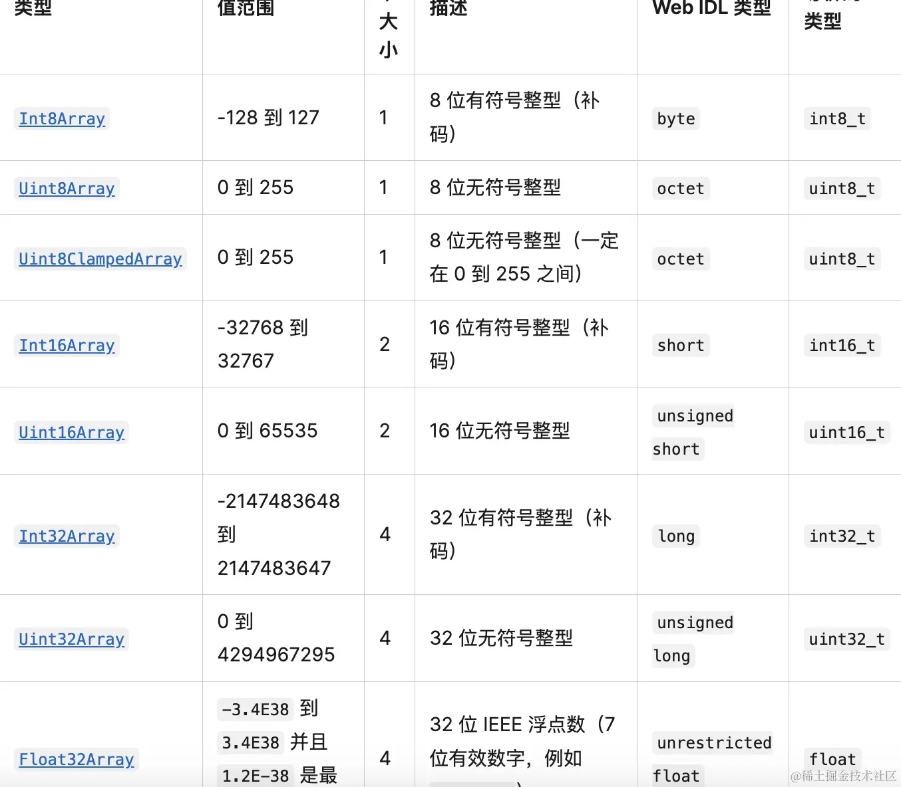

# 构建自定义几何体

## 步骤

+ 步骤1 创建一个空的几何体对象

  ```js
  const geometry = new THREE.BufferGeometry();
  ```

+ 步骤2 定义几何体顶点数据：通过js类型化数组 `Float32Array` 创建一组xyz坐标数据用来表示几何体的顶点坐标

  ```js
  // 类型化数组创建顶点数据
  const vertices = new Float32Array([
    0,0,0, // 顶点1坐标
    50,0,0, // 顶点2坐标
    0,100,0, // 顶点3坐标
    0,0,10, // 顶点4坐标
    0,0,100, // 顶点5坐标
    50,0,10, // 顶点6坐标
  ]);
  ```

+ 步骤3 通过threejs的属性缓冲区对象 `BufferAttribute` 表示threejs几何体顶点数据

  ```js
  // 创建属性缓冲对象
  // 3 个为一组，表示一个顶点的xyz坐标
  const attribur = new THREE.BufferGeometry(vertices, 3)
  ```

+ 步骤4 通过 `geometry.attributes.position` 设置几何体顶点位置属性的值 `BufferAttribute`

  ```js
  // 设置几何体attributes属性的位置属性
  geometry.attributes.position = attribue;
  ```

+ 步骤5 添加场景或者几何体中

+ 总结

  ```js
  import * as THREE from 'three';

  const geometry = new THREE.BufferGeometry();

  // 顶点坐标
  const vertices = new Float32Array([
    0, 0, 0,
    100, 0, 0,
    0, 100, 0,
    0, 0, 10,
    0, 0, 100,
    100, 0, 10
  ]);

  // 顶点数据
  const attribute = new THREE.BufferAttribute(vertices, 3);
  geometry.attributes.position = attribute;

  // 材质
  const material = new THREE.MeshBasicMaterial({
    color: new THREE.Color('orange')
  });

  // 网格模型
  const mesh = new THREE.Mesh(geometry, material);

  export default mesh;
  ```

## Float32Array

+ Float32Array 是 JS 提供的 TypedArray 相关 api 中的一个：

  

+ JS 提供了 ArrayBuffer 用来存储二进制数据，而 TypedArray 可以用不同的类型来读写这个 ArrayBuffer
