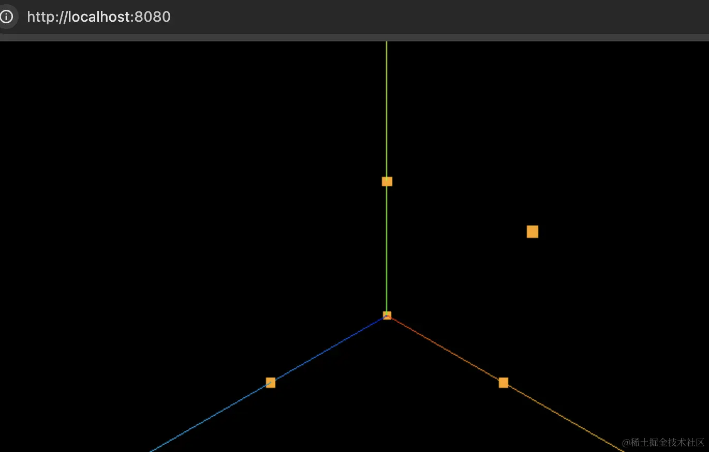

# 点 Points

## 点模型

+ 点模型Points和网格模型Mesh一样，都是threejs的一种模型对象，只是大部分情况下都是用Mesh表示物体

## 构造函数 Points( geometry : BufferGeometry, material : Material )

+ `new THREE.Points(geometry, material)` 接受两个参数来定义点云：

+ 参数

  +geometry —— （可选）是一个BufferGeometry的实例，默认值是一个新的 `BufferGeometry`

  + material —— （可选） 是一个对象，默认值是一个 `PointsMaterial`


  ```js
  import * as THREE from 'three';

  const geometry = new THREE.BufferGeometry();

  const vertices = new Float32Array([
    0, 0, 0,
    100, 0, 0,
    0, 100, 0,
    0, 0, 100,
    100, 100, 0
  ]);
  const attribute = new THREE.BufferAttribute(vertices, 3);
  geometry.attributes.position = attribute;

  const material = new THREE.PointsMaterial({
    color: new THREE.Color('orange'),
    size: 10
  });

  // 直接渲染点模型 Points
  const points = new THREE.Points(geometry, material);

  export default points;
  ```

  

## 示例

+ 示例2

  ```js
  // 创建了一个包含 1000 个随机点的点云，并为每个点指定了随机颜色
  // 使用 THREE.PointsMaterial 设置了点的大小、透明度，并启用了顶点颜色

  // 创建顶点数组
  const positions = [];
  const colors = [];

  // 生成多个随机点
  for (let i = 0; i < 1000; i++) {
    positions.push((Math.random() - 0.5) * 20);
    positions.push((Math.random() - 0.5) * 20);
    positions.push((Math.random() - 0.5) * 20);

    // 为每个点设置随机颜色
    const r = Math.random();
    const g = Math.random();
    const b = Math.random();
    colors.push(r);
    colors.push(g);
    colors.push(b);
  }

  // 创建 BufferGeometry 并设置顶点数据和颜色数据
  const geometry = new THREE.BufferGeometry();
  geometry.setAttribute('position', new THREE.Float32BufferAttribute(positions, 3));
  geometry.setAttribute('color', new THREE.Float32BufferAttribute(colors, 3));

  // 创建 PointsMaterial
  const material = new THREE.PointsMaterial({
    size: 0.1,
    vertexColors: true,
    transparent: true,
    opacity: 0.5,
  });

  // 创建 Points
  const points = new THREE.Points(geometry, material);

  // 将点云添加到场景中
  scene.add(points);
  ```

+ 创建一个带有纹理的粒子系统

  ```js
  // 为点云中的每个点添加纹理，可以使用 THREE.TextureLoader 加载纹理，并在材质中使用

  // 加载纹理
  const textureLoader = new THREE.TextureLoader();
  const particleTexture = textureLoader.load('path/to/particleTexture.png');

  // 创建 PointsMaterial
  const material = new THREE.PointsMaterial({
    map: particleTexture,
    size: 0.1,
    transparent: true,
    opacity: 0.5,
  });

  // 创建 Points
  const points = new THREE.Points(geometry, material);

  // 将点云添加到场景中
  scene.add(points);
  ```
