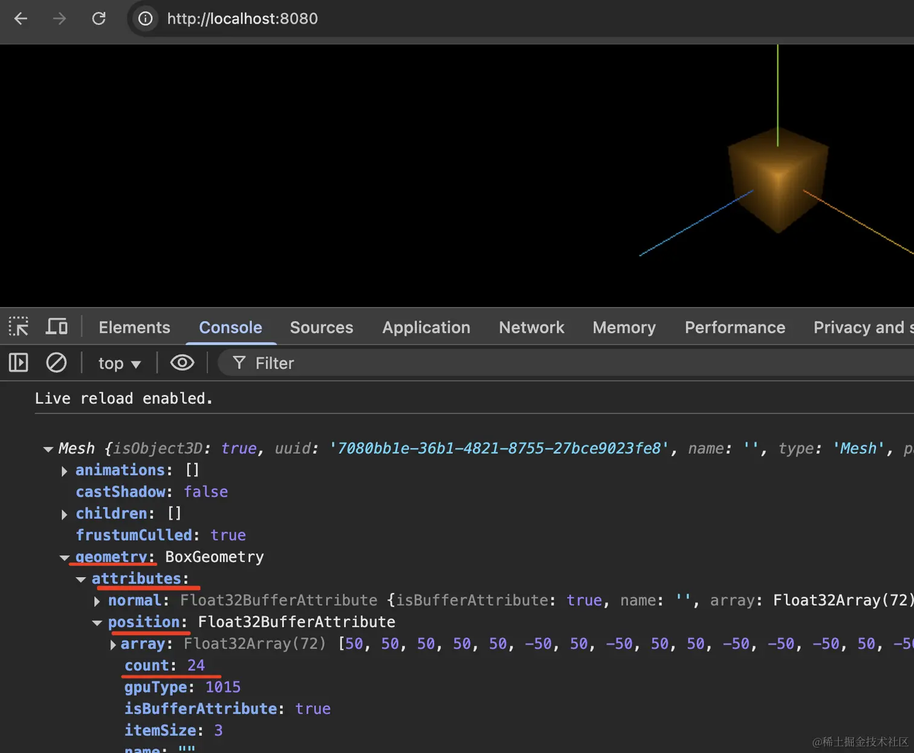

# 查看threejs自带几何体顶点

## 概述

+ three.js提供的矩形平面PlaneGeometry、长方体BoxGeometry、球体SphereGeometry等各种形状的几何体，他们都有一个共同的父类BufferGeometry
+ 这意味着这些几何体有哪些属性或方法

## 查看几何体顶点位置和索引数据

+ 可以用顶点索引index数据构建几何体，也可以不用，threejs默认的大部分几何体都有三角形的顶点索引数据，具体可以通过浏览器控制台打印几何体数据查看

  ```js
  const geometry = new THREE.PlaneGeometry(100,50); //矩形平面几何体

  // const geometry = new THREE.BoxGeometry(50,50,50); //长方体

  console.log('几何体',geometry);
  console.log('顶点位置数据',geometry.attributes.position);
  console.log('顶点索引数据',geometry.index);
  ```

  
