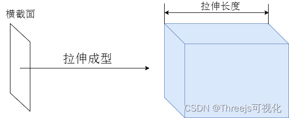

# 基础

## 拉伸几何体是什么

+ 拉伸是指我们有一个二维图形，通过针对这个二维图形进行z轴拉伸，将它转换成三维图形

  + 如果我们拉伸​ THREE.CircleGeometry ，就会得到一个类似圆柱体的图形
  + 如果我们拉伸​ THREE.PlaneGeometry ，就会得到一个立方体

  

## 构造函数

+ `new THREE.ExtrudeGeometry(shape, extrudeSettings)`

  + shape：一个 THREE.Shape 对象，定义了要挤出的二维轮廓

  + extrudeSettings：一个包含挤出参数的对象，可选参数包括：

    + amount：挤出的距离，默认为 100
    + bevelEnabled：是否启用倒角，默认为 true
    + bevelThickness：倒角厚度，默认为 10
    + bevelSize：倒角大小，默认为 8
    + bevelSegments：倒角分割数量，默认为 1
    + steps：挤出路径分割的数量，默认为 1
    + curveSegments：曲线分割数量，默认为 12
    + uvGenerator：UV 坐标生成器，默认为 THREE.ExtrudeGeometryUVGenerator

  ```js
  // 创建一个矩形轮廓，并沿 Z 轴挤出 20 个单位的距离
  // 由于 bevelEnabled 设置为 false，所以没有倒角效果
  const shape = new THREE.Shape();
  shape.moveTo(10, 10);
  shape.lineTo(90, 10);
  shape.lineTo(90, 90);
  shape.lineTo(10, 90);
  shape.closePath();

  const extrudeSettings = {
    amount: 20,
    bevelEnabled: false
  };

  const geometry = new THREE.ExtrudeGeometry(shape, extrudeSettings);

  // 设置材质
  const material = new THREE.MeshBasicMaterial({ color: 0xff0000 });
  const mesh = new THREE.Mesh(geometry, material);
  scene.add(mesh);
  ```
