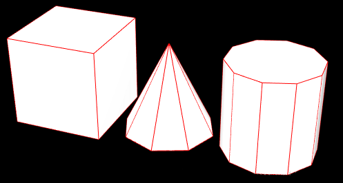

# 边界线框 EdgesGeometry

## EdgesGeometry 概述

+ THREE.EdgesGeometry 是 Three.js 中的一个类，用于从现有的几何体（如 THREE.Geometry 或 THREE.BufferGeometry）中提取边缘信息，以便能够渲染几何体的边缘线条
+ 这对于创建带有轮廓线的效果特别有用，例如在卡通渲染、技术图纸或增强现实应用中

  

## 构造函数

+ `new THREE.EdgesGeometry(geometry, thresholdAngle)`

  + geometry：源几何体，可以是任何 `THREE.Geometry` 或 `THREE.BufferGeometry`
  + thresholdAngle：阈值角度（单位为度），用于决定哪些边被视为边缘。如果相邻的两个面之间的夹角大于或等于这个阈值，则这条边将被视为边缘。默认值为 45 度

  ```js
  // 长方体外部线框

  var box = new THREE.BoxGeometry(30, 30, 30);
  var boxMaterial = new THREE.MeshPhongMaterial({
    color: 0xffff00,
  });
  // 立方体网格模型
  var boxMesh = new THREE.Mesh(box, boxMaterial);

  // 立方体几何体box作为EdgesGeometry参数创建一个新的几何体
  var edges = new THREE.EdgesGeometry(box);
  // 立方体线框，不显示中间的斜线
  var edgesMaterial = new THREE.LineBasicMaterial({
    color: 0xffffff
  })
  var line = new THREE.LineSegments(edges,edgesMaterial);
  // 网格模型和网格模型对应的轮廓线框插入到场景中
  scene.add(boxMesh,line);
  ```

## 使用 THREE.EdgesGeometry

+ 创建边缘几何体后，通常需要为它添加一个线条材质，并创建一个 `THREE.Line` 或 `THREE.LineSegments` 对象来将其添加到场景中

  ```js
  // 创建一个带有边缘线条的立方体
  // 创建立方体几何体
  const boxGeometry = new THREE.BoxGeometry(1, 1, 1);

  // 创建漫反射材质
  const meshMaterial = new THREE.MeshBasicMaterial({ color: 0xff0000 });

  // 创建立方体网格
  const mesh = new THREE.Mesh(boxGeometry, meshMaterial);

  // 创建边缘几何体
  const edges = new THREE.EdgesGeometry(boxGeometry);

  // 创建线条材质
  const lineMaterial = new THREE.LineBasicMaterial({ color: 0x0000ff });

  // 使用边缘几何体创建线条
  const line = new THREE.LineSegments(edges, lineMaterial);

  // 将网格和线条添加到场景中
  scene.add(mesh);
  scene.add(line);
  ```

## 调整阈值角度

+ 通过调整 thresholdAngle 参数，可以改变边缘识别的标准。较大的角度阈值会导致较少的边缘线条被识别出来，而较小的角度阈值则会产生更多的边缘线条

  ```js
  const boxGeometry = new THREE.BoxGeometry(1, 1, 1);
  const edges = new THREE.EdgesGeometry(boxGeometry, 30); // 阈值角度设为 30 度
  const lineMaterial = new THREE.LineBasicMaterial({ color: 0x0000ff });
  const line = new THREE.LineSegments(edges, lineMaterial);
  scene.add(line);
  ```
