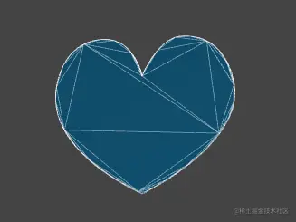

# 形状缓冲几何体 ShapeGeometr

## 概述

+ THREE.ShapeGeometry 是 Three.js 中用于从一个或多个 THREE.Shape 对象创建几何体的一个类
+ `THREE.Shape` 是一种描述二维路径的方法，可以用来定义各种形状的轮廓
+ 通过 `THREE.ShapeGeometry` ，可以将这些二维路径转换成三维几何体，适用于创建各种基于轮廓的三维模型，例如字母、图标、徽标等

+ 从一个或多个路径形状中创建一个单面多边形几何体

  

## 构造函数

+ `new THREE.ShapeGeometry(shapes, options)`

  + shapes：一个或多个 THREE.Shape 对象，定义了几何体的二维轮廓
  + options：一个对象，包含几何体的生成选项，可选参数包括：

    + extrudePath：一个 THREE.CurvePath 对象，定义了挤出路径的方向和形状。如果未指定，则默认沿 Z 轴挤出
    + extrudeSettings：一个对象，包含挤出设置，具体参数如下：

      + amount：挤出距离，默认为 100
      + bevelEnabled：是否启用倒角，默认为 true
      + bevelThickness：倒角厚度，默认为 10
      + bevelSize：倒角大小，默认为 8
      + bevelSegments：倒角分割数量，默认为 3
      + steps：挤出路径分割的数量，默认为 1
      + uvGenerator：UV 坐标生成器，默认为 THREE.ExtrudeGeometryUVGenerator

  ```js
  // 创建一个矩形轮廓，并沿 Z 轴挤出 20 个单位的距离
  const shape = new THREE.Shape();
  shape.moveTo(10, 10);
  shape.lineTo(90, 10);
  shape.lineTo(90, 90);
  shape.lineTo(10, 90);
  shape.closePath();

  // 创建 ShapeGeometry
  const geometry = new THREE.ShapeGeometry([shape], { extrudeSettings: { amount: 20 } });

  // 创建材质和 Mesh
  const material = new THREE.MeshBasicMaterial({ color: 0xff0000 });
  const mesh = new THREE.Mesh(geometry, material);
  scene.add(mesh);
  ```

## 使用挤出路径

+ 可以使用挤出路径来控制挤出的方向，这可以用来创建更加复杂的几何体

  ```js
  // 创建一个矩形形状
  const shape = new THREE.Shape();
  shape.moveTo(10, 10);
  shape.lineTo(90, 10);
  shape.lineTo(90, 90);
  shape.lineTo(10, 90);
  shape.closePath();

  // 创建挤出路径
  const path = new THREE.CatmullRomCurve3([
      new THREE.Vector3(0, 0, 0),
      new THREE.Vector3(0, 0, 20)
  ]);

  // 创建 ShapeGeometry
  const geometry = new THREE.ShapeGeometry([shape], { extrudePath: path, extrudeSettings: { amount: 20 } });

  // 创建材质和 Mesh
  const material = new THREE.MeshBasicMaterial({ color: 0xff0000 });
  const mesh = new THREE.Mesh(geometry, material);
  scene.add(mesh);
  ```

## 使用倒角效果

+ 通过调整 extrudeSettings 中的倒角参数，可以为几何体添加倒角效果

  ```js
  // 创建一个矩形形状
  const shape = new THREE.Shape();
  shape.moveTo(10, 10);
  shape.lineTo(90, 10);
  shape.lineTo(90, 90);
  shape.lineTo(10, 90);
  shape.closePath();

  // 创建 ShapeGeometry
  const geometry = new THREE.ShapeGeometry([shape], {
    extrudeSettings: {
      amount: 20,
      bevelEnabled: true,
      bevelThickness: 5,
      bevelSize: 5,
      bevelSegments: 2
    }
  });

  // 创建材质和 Mesh
  const material = new THREE.MeshBasicMaterial({ color: 0xff0000 });
  const mesh = new THREE.Mesh(geometry, material);
  scene.add(mesh);
  ```

## 使用多个形状

+ 可以使用多个形状来定义一个几何体，例如创建一个带孔洞的几何体

  ```js
  // 创建一个外部矩形形状
  const shape = new THREE.Shape();
  shape.moveTo(10, 10);
  shape.lineTo(90, 10);
  shape.lineTo(90, 90);
  shape.lineTo(10, 90);
  shape.closePath();

  // 创建一个内部矩形孔洞
  const hole = new THREE.Path();
  hole.moveTo(30, 30);
  hole.lineTo(70, 30);
  hole.lineTo(70, 70);
  hole.lineTo(30, 70);
  hole.closePath();

  shape.holes.push(hole);

  // 创建 ShapeGeometry
  const geometry = new THREE.ShapeGeometry([shape], { extrudeSettings: { amount: 20 } });

  // 创建材质和 Mesh
  const material = new THREE.MeshBasicMaterial({ color: 0xff0000 });
  const mesh = new THREE.Mesh(geometry, material);
  scene.add(mesh);
  ```

## 使用其他材质

+ 除了 THREE.MeshBasicMaterial 之外，你还可以使用其他材质，比如 THREE.MeshStandardMaterial 或 THREE.MeshPhysicalMaterial 等，这些材质支持物理基渲染（Physically Based Rendering, PBR），可以使你的几何体看起来更加真实

  ```js
  // 创建一个矩形形状
  const shape = new THREE.Shape();
  shape.moveTo(10, 10);
  shape.lineTo(90, 10);
  shape.lineTo(90, 90);
  shape.lineTo(10, 90);
  shape.closePath();

  // 创建 ShapeGeometry
  const geometry = new THREE.ShapeGeometry([shape], { extrudeSettings: { amount: 20 } });

  // 创建材质和 Mesh
  const material = new THREE.MeshStandardMaterial({ color: 0x44aa88, metalness: 0.5, roughness: 0.5 });
  const mesh = new THREE.Mesh(geometry, material);
  scene.add(mesh);
  ```

## 使用纹理

+ 可以使用纹理贴图来定义几何体的外观

  ```js
  const textureLoader = new THREE.TextureLoader();
  const texture = textureLoader.load('path/to/texture.jpg');

  // 创建一个矩形形状
  const shape = new THREE.Shape();
  shape.moveTo(10, 10);
  shape.lineTo(90, 10);
  shape.lineTo(90, 90);
  shape.lineTo(10, 90);
  shape.closePath();

  // 创建 ShapeGeometry
  const geometry = new THREE.ShapeGeometry([shape], { extrudeSettings: { amount: 20 } });

  // 创建材质和 Mesh
  const material = new THREE.MeshBasicMaterial({ map: texture });
  const mesh = new THREE.Mesh(geometry, material);
  scene.add(mesh);
  ```
