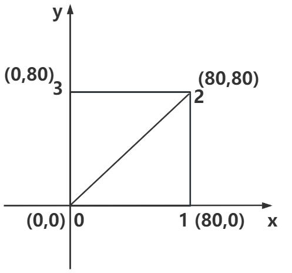

# 几何体顶点索引数据 index

## 概述

+ 网格模型Mesh对应的几何体BufferGeometry，拆分为多个三角后，很多三角形重合的顶点位置坐标是相同的
+ 这时候如果你想减少顶点坐标数据量，可以借助几何体顶点索引 `geometry.index` 来实现

## 定义顶点位置坐标数据

+ 每个三角形3个顶点坐标，矩形平面可以拆分为两个三角形，也就是6个顶点坐标

  ```js
  const vertices = new Float32Array([
    0, 0, 0, //顶点1坐标
    80, 0, 0, //顶点2坐标
    80, 80, 0, //顶点3坐标
    0, 0, 0, //顶点4坐标   和顶点1位置相同
    80, 80, 0, //顶点5坐标  和顶点3位置相同
    0, 80, 0, //顶点6坐标
  ]);
  ```

+ 如果几何体有顶点索引 `geometry.index` ，那么你可以把三角形重复的顶点位置坐标删除

  ```js
  const vertices = new Float32Array([
    0, 0, 0, //顶点1坐标
    80, 0, 0, //顶点2坐标
    80, 80, 0, //顶点3坐标
    0, 80, 0, //顶点4坐标
  ]);
  ```

  

## BufferAttribute 定义顶点索引 .index 数据

+ 通过js类型化数组Uint16Array创建顶点索引 `.index` 数据

  ```js
  // Uint16Array类型数组创建顶点索引数据
  const indexes = new Uint16Array([
    // 下面索引值对应顶点位置数据中的顶点坐标
    0, 1, 2, 0, 2, 3,
  ])
  ```

+ 通过threejs的属性缓冲区对象 `BufferAttribute` 表示几何体顶点索引.index数据

  ```js
  // 索引数据赋值给几何体的index属性
  geometry.index = new THREE.BufferAttribute(indexes, 1); //1个为一组
  ```

## 示例

+ 示例

  ```js
  //创建一个空的几何体对象
  const geometry = new THREE.BufferGeometry();

  //类型化数组创建顶点数据
  const vertices = new Float32Array([
    0, 0, 0, //顶点1坐标
    80, 0, 0, //顶点2坐标
    80, 80, 0, //顶点3坐标
    0, 80, 0, //顶点4坐标
  ]);

  // 创建属性缓冲区对象
  // 3个为一组，表示一个顶点的xyz坐标
  const attribue = new THREE.BufferAttribute(vertices, 3);
  // 设置几何体attributes属性的位置属性
  geometry.attributes.position = attribue;

  // Uint16Array类型数组创建顶点索引数据
  const indexes = new Uint16Array([
    // 下面索引值对应顶点位置数据中的顶点坐标
    0, 1, 2, 0, 2, 3,
  ])

  // 索引数据赋值给几何体的index属性
  geometry.index = new THREE.BufferAttribute(indexes, 1); //1个为一组

  // 线模型对象
  const metr = new THREE.MeshBasicMaterial({
    color: 0xff0000,
    // side: THREE.DoubleSide, //两面可见
  })

  // 创建线模型对象
  const mesh = new THREE.Mesh(geometry, metr);

  // 将几何体添加到场景中
  scene.add( Model );
  ```

