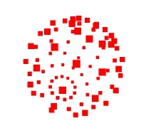

# 示例

## 点模型查看曲线上顶点坐标

+ 点模型查看曲线上顶点坐标

  ```js
  import { EllipseCurve,Points,BufferGeometry, PointsMaterial} from 'three';

  const arc = new EllipseCurve(0, 0, 100, 50);

  const pointsArr = arc.getPoints(50); //分段数50，返回51个顶点
  console.log('曲线上获取坐标',pointsArr);

  const geometry = new BufferGeometry()
  geometry.setFromPoints(pointsArr)

  // 点材质对象
  const material = new PointsMaterial({
    color: 0xff0000,
    size: 10.0 //点对象像素尺寸
  })

  // 点模型对象
  const points = new Points(geometry, material)

  export default points;
  ```

## 球

+ code

  ```js
  const radius = 7;
  const widthSegments = 12;
  const heightSegments = 8;
  const geometry = new THREE.SphereGeometry(radius, widthSegments, heightSegments);
  const material = new THREE.PointsMaterial({
      color: 'red',
      size: 0.2,     // in world units
  });
  const points = new THREE.Points(geometry, material);
  scene.add(points);
  ```

  

+ 如果你想让点无视和摄像机的距离，始终保持相同大小，可以通过将 `sizeAttenuation` 设置成 `false` 将其关闭

  ```js
  const material = new THREE.PointsMaterial({
    color: 'red',
    sizeAttenuation: false,
    size: 3,       // in pixels
    // size: 0.2,     // in world units
  });
  ```
