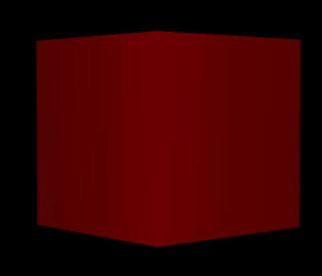

# 联合材质

## 概述

+ 例如 MeshDepthMaterial材质是一种由摄像机距离来确定的样式的材质，它不能设置颜色，但是大多数的时候我们需要设置一个颜色，那怎么做呢？

+ 由上面我们知道MeshBasicMaterial是可以设置颜色的，只要把两种材质联合起来就可以了，这里说的联合材质并不是一种材质，而是把多个材质混合起来的一种办法，要使用联合材质首先需要引入SceneUtils.js文件，该文件必须在three.js的下方引入

  ```js
  <script type="text/javascript" src="../node_modules/three/examples/js/utils/SceneUtils.js"></script>
  ```

+ 引入上面的JS文件后，会多出一个THREE.SceneUtils的类，该类的对象有一个createMultiMaterialObject方法，可以创建多种混合材质的网格（Mesh），具体代码如下

  ```js
  var geometry = new THREE.BoxGeometry(10, 10, 10,3, 3, 3);
  var depthMaterial = new THREE.MeshDepthMaterial();
  var colorMaterial = new THREE.MeshBasicMaterial({
      color: '#ff0000',
      transparent: true,
      blending: THREE.MultiplyBlending
  });
  mesh = new THREE.SceneUtils.createMultiMaterialObject(geometry, [depthMaterial, colorMaterial]);
  scene.add(mesh);
  ```

+ 注意这里的Mesh不再是通过 `new THREE.Mesh(geometry, material);` 这样来创建的。此时效果如下

  
