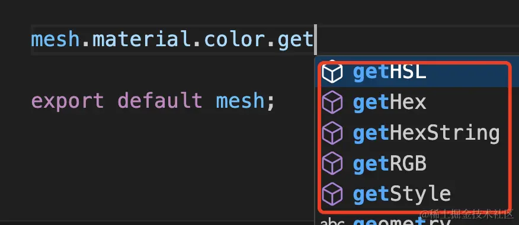
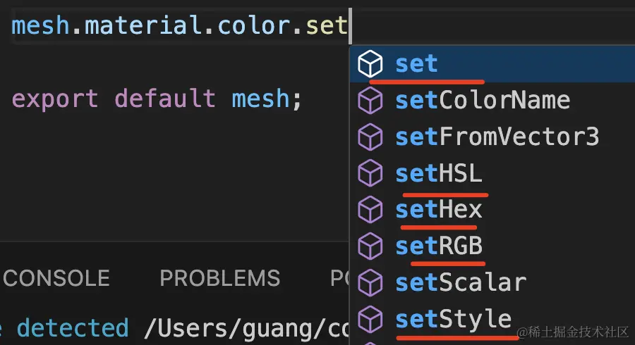

# 获取 与 设置 颜色

## 获取颜色

+ 可以以各种格式拿到它的颜色值

  ```js
  const color = mesh.material.color;
  console.log(color.getHexString()); // ffa500

  // style 是 css 样式的意思，可以用 css 写样式的方式来设置获取 color
  console.log(color.getStyle()); // rgb(255,165,0)
  color.setStyle('blue');

  ```

  

## 设置颜色

+ 可以设置颜色值

  
