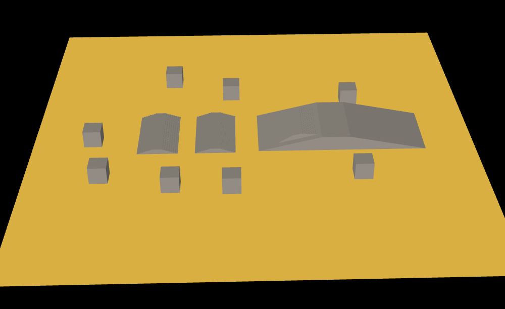

# OctreeHelper 可视化八叉树

## 概述

+ Three.js在目录 `/examples/jsm/helpers/` 下提供了一个可视化八叉树相关的扩展库OctreeHelper.js

  ```js
  import { OctreeHelper } from 'three/examples/jsm/helpers/OctreeHelper.js';
  ```

  ```js
  const helper = new OctreeHelper( worldOctree );

  scene.add( helper );
  ```

  
  
