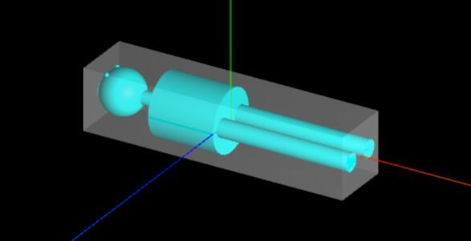

# 包围盒Box3

## 概述

+ https://threejs.org/docs/index.html?q=Box#api/zh/helpers/Box3Helper

+ 所谓包围盒Box3，就是一个长方体空间，把模型的所有顶点数据包围在一个最小的长方体空间中，这个最小长方体空间就是该模型的包围盒Box3

  

## Three.js 中的应用

+ 在渲染前进行快速的碰撞检测，以决定哪些对象需要进一步的精确检测
+ 计算物体的包围盒，用于确定物体的可见性
+ 在处理用户交互时，检测鼠标点击是否在某个对象的范围内
+ 在物理模拟中，用于快速判断物体之间是否可能发生碰撞
+ 获取模型的大小

## 构造函数

+ `new THREE.Box3(min, max)` 包围盒Box3表示三维长方体包围区域，使用min和max两个属性来描述该包围区域，Box3的min和max属性值都是三维向量对象Vector3

+ 描述一个长方体包围盒需要通过xyz坐标来表示

  + X范围 `[Xmin,Xmax]`
  + Y范围 `[Ymin,Ymax]`
  + Z范围 `[Zmin,Zmax]`
  + `.min` 属性值是 `Vector3(Xmin, Ymin, Zmin)`
  + `.max` 属性值是 `Vector3(Xmax, Ymax, Zmin)`

  ```js
  const box3 = new THREE.Box3()
  console.log('box3',box3);
  box3.min = new THREE.Vector3(-10, -10,0);
  box3.max = new THREE.Vector3(100, 20,50);
  ```

+ 如果未提供 min 和 max 参数，构造函数将创建一个空的包围盒（即所有点都位于无穷远处）
