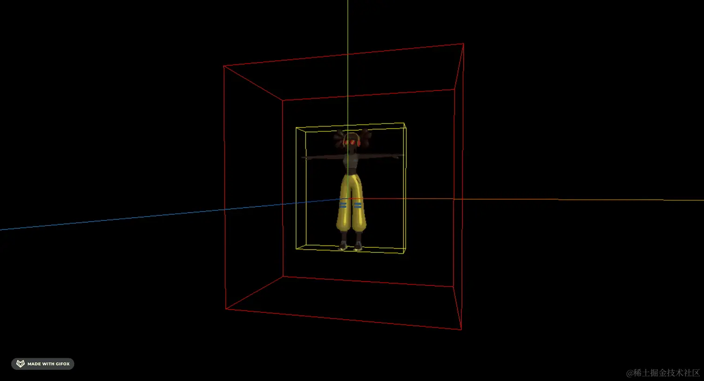
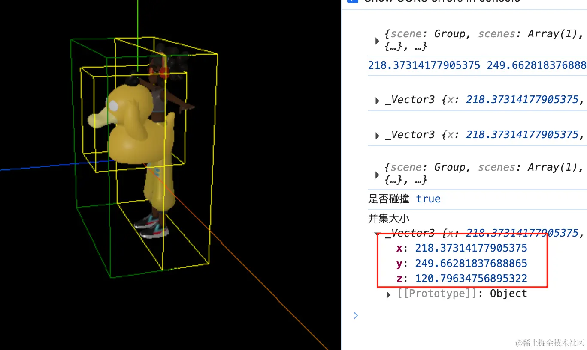

# 方法

## 概述

+ set(min, max)：设置包围盒的最小和最大边界点
+ setFromPoints(points)：从一组点中设置包围盒
+ expandByPoint(point)：将包围盒扩展以包含指定的点
+ expandByVector(vector)：将包围盒扩展指定的向量大小
+ expandByScalar(scalar)：将包围盒沿所有方向扩展指定的标量大小
+ isEmpty()：检查包围盒是否为空
+ makeEmpty()：清空包围盒
+ containsPoint(point)：检查指定的点是否在包围盒内
+ containsBox(box)：检查指定的包围盒是否完全包含在当前包围盒内
+ getCenter(target)：计算包围盒的中心点，并将结果存储在 target 向量中
+ getSize(target)：计算包围盒的大小（宽度、高度和深度），并将结果存储在 target 向量中
+ intersect(box)：计算当前包围盒与指定包围盒的交集
+ union(box)：计算当前包围盒与指定包围盒的并集
+ clampPoint(point, target)：将指定的点限制在包围盒内，并将结果存储在 target 向量中
+ distanceToPoint(point)：计算指定点到包围盒的最近距离
+ getParameter(point)：计算指定点在包围盒内的参数坐标
+ intersectsBox(box)：判断当前包围盒是否与指定包围盒相交
+ intersectsSphere(sphere)：判断当前包围盒是否与指定的球体相交
+ intersectsPlane(plane)：判断当前包围盒是否与指定的平面相交
+ applyMatrix4(matrix)：将矩阵应用到包围盒上
+ translate(offset)：将包围盒沿着指定的偏移量移动
+ equals(box)：检查当前包围盒是否等于指定包围盒

## 计算模型最小包围盒.expandByObject()

+ 模型对象，比如mesh或group，作为 `.expandByObject()` 的参数，可以计算该模型的包围盒

  ```js
  const box3 = new THREE.Box3();
  box3.expandByObject(mesh); // 计算模型包围盒
  console.log('查看包围盒',box3);
  ```

## 包围盒尺寸.getSize()

+ 返回包围盒具体的长宽高尺寸

  ```js
  const scale = new THREE.Vector3()
  // getSize()计算包围盒尺寸
  // 获得包围盒长宽高尺寸，结果保存在参数三维向量对象scale中
  box3.getSize(scale)
  console.log('模型包围盒尺寸', scale);
  ```

## expandByScalar 扩展包围盒

+ 扩展包围盒的大小

  ```js
  const box3 = new THREE.Box3();

  // 扩展 100 = 三个方向都加上了 100 的大小 = 左+100 右+100 上+100 下+100
  box3.expandByScalar(100);
  ```

  

## 包围盒几何中心.getCenter()

+ Box3方法 `.getCenter()` 计算返回包围盒几何中心位置

  ```js
  // 计算包围盒中心坐标
  const center = new THREE.Vector3()
  box3.getCenter(center)
  console.log('模型中心坐标', center);
  ```

## union(box)：计算当前包围盒与指定包围盒的并集

+ 并集

  ```js
  const unionBox = box2.union(box3);

  const size = unionBox.getSize(new THREE.Vector3());
  console.log('并集大小',size);

  // 可视化并集
  const unionBox = box2.union(box3);
  const helper4 = new THREE.Box3Helper(unionBox, 'green');
  ```

  

+ 方式2：获取并集大小，通过添加共同的父级

  ```js
  const group = new THREE.Group();
  group.add(gltf.scene, gltf2.scene);
  mesh.add(group);
  const box4 = new THREE.Box3();

  box4.setFromObject(group);

  const helper5 = new THREE.Box3Helper(box4, 'green');
  mesh.add(helper5);
  const size = box4.getSize(new THREE.Vector3());
  console.log('并集大小',size);
  ```

## intersectsBox 是否相交

+ 用来判断两个包围盒是否相交，返回 boolean
+ 可以用来做碰撞检测

  ```js
  const box2 = new THREE.Box3();
  box2.setFromObject(gltf.scene);

  const box3 = new THREE.Box3();
  box3.setFromObject(gltf2.scene);

  console.log('是否碰撞', box2.intersectsBox(box3));
  ```

## intersect 相交部分大小

+ 可以判断两个包围和相交部分的大小

  ```js
  const intersectBox = box2.intersect(box3);
  const size = intersectBox.getSize(new THREE.Vector3());
  console.log('相交部分大小',size);
  ```

## 示例

+ 示例

  ```js
  import * as THREE from "three";

  const geometry = new THREE.BoxGeometry(50, 50, 50);
  const material = new THREE.MeshLambertMaterial({
    color: 0x00ffff,
  });
  const mesh = new THREE.Mesh(geometry, material);
  // 将几何体添加到场景中

  // 包围盒
  (() => {
    const scale = new THREE.Vector3()
    const box3 = new THREE.Box3()
    console.log('box3',box3);

    box3.expandByObject(mesh); // 计算模型包围盒

    box3.getSize(scale)

    console.log('模型包围盒尺寸', scale);
  })();
  ```
